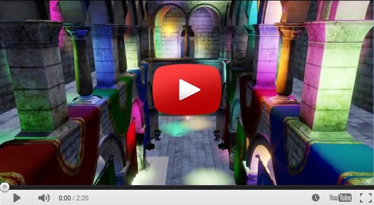
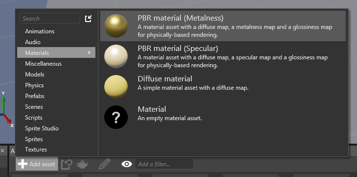
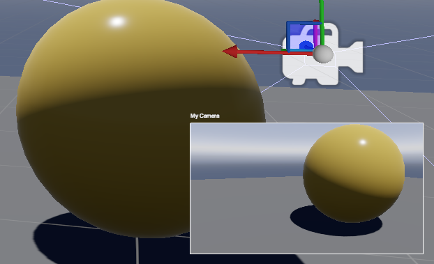
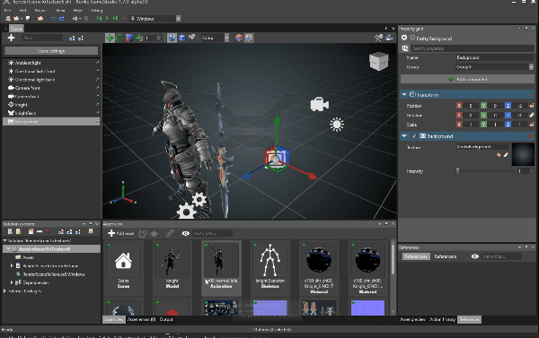
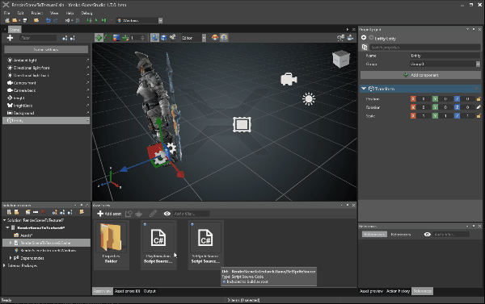

# Highlights

## Rendering

### Forward+

Xenko now features [Practical Clustered Shading](http://www.humus.name/Articles/PracticalClusteredShading.pdf), a technique similar to Forward+ rendering.

It allows you to use many point and spot lights at the same time.
You will gain more control over the lighting of your scene by adding lights wherever they are needed.
It also works with transparent objects out of the box, just like ordinary forward rendering does.

[](https://www.youtube.com/watch?v=QWZqNT9xD5Q "Hundreds of lights")

If your game requires Direct3D10+ (or equivalent OpenGL), this will be the default setting - no changes needed! As a bonus, you'll see a decrease in compilation times and the number of shader permutations.

We also took this opportunity to rewrite most of our lighting code for improved performance and extensibility.

### Vulkan

[Vulkan](https://www.khronos.org/vulkan/) joins our happy family of graphics platforms!
Experimental support has also been added for Windows and Linux. Android will follow soon.


Together with Direct3D12 and the recent overhaul of our rendering pipeline, this is another step toward preparing Xenko for the next generation of graphics. Stay tuned for performance improvements and hard numbers in the near future.

Try running your project on Vulkan by selecting it as the **Preferred Graphics Platform** in the **Rendering Settings** of your **Game Settings** asset.

## GameStudio Improvements

### Simplified Asset Creation

The workflow to create assets has been simplified! The new menu for asset creation contains multiple templates for each type of asset. You can now import assets from files more directly. With Xenko's efficient search function, creating assets should be faster and easier than ever!



### Camera Preview

We've updated GameStudio's camera preview to now display only the camera currently selected. It also now displays the borders and the camera's name making it easier to see the camera and it's settings.



### Drag & Drop Assets into the Property Grid

So far, you could drag & drop assets into your scene or the tree view.

New in this release, components can now be added to entities just by dragging & dropping matching assets into the property grid.



### Drag & Drop scripts

You can also drag & drop scripts directly into the scene, tree view and property view:



## Linux

Linux users rejoice! Linux is now a supported platform of Xenko among Windows, Android, iOS, and more! All you need is a PC running Linux Ubuntu 16.04 x64 or equivalent with a video card supporting OpenGL 4.2 or Vulkan 1.0. Mono or .NET Core (which need to be installed separately) will be powering your game.

In order to use the **Linux** platform, check **Linux** from the list of platforms in the GameStudio then compile.


Deployment to a remote Linux box is done via SSH when running your project from GameStudio.


To know more about our Linux support, read the [Linux documentation](manual/platforms/linux/index.md)

## Audio

We've rewritten our Audio engine! 
While most changes are internal, the public API has improved, and we are still working to make it great!

The `SoundEffect` and `SoundMusic` classes have been consolidated into `Sound`, also `SoundEffectInstance` is now `SoundInstance`. Sound formats are now converted using [FFmpeg](https://ffmpeg.org/). Because of these updates, the range of supported formats has also improved.

Under the hood, the [CELT](http://celt-codec.org/) codec (part of [Opus](https://www.opus-codec.org/)) is now being used. We're delighted to say that performance has since skyrocketed! Music can now be mixed and crossfaded while streaming and decompressing directly from disk.

Xenko's API now builds on OpenAL for Linux/macOS/iOS, on OpenSLES for Android and on XAudio2 for Windows platforms.

# How To Upgrade

This section explains how to migrate a project from version 1.6.x to version 1.7.x.

## UIComponent

- `VirtualResolution` property has been renamed to `Resolution`
- `VirtualResolutionMode` property has been renamed to `ResolutionStretch`

## ISpriteProvider

The properties of type `Sprite` have been changed to properties of type `ISpriteProvider`. Currently two implementations of `ISpriteProvider` are available:
* `SpriteFromSheet` for use with a `SpriteSheet` (i.e. a collection of `Sprite`)
* `SpriteFromTexture` for use with a single `Texture`

To upgrade where a single Sprite was previously used cast the assignment with the following (`SpriteFromTexture` provides a convenient explicit converter from `Sprite`).

```
var button = new Button
{
  PressedImage = (SpriteFromTexture)new Sprite(Content.Load<Texture>("ImageButtonPressed"))
}
```

To upgrade where a sprite from a SpriteSheet was previously used:
Create a new `SpriteFromSheet` and provide a reference to the `SpriteSheet` instance and the corresponding frame index.

```
var button = new Button
{
  PressedImage = new SpriteFromSheet
  {
    Sheet = sprites,
    CurrentFrame = sprites.FindImageIndex("ButtonPressed")
  }
}
```

For convenience, we provide a helper method which does exactly the same: `SpriteFromSheet.Create(sprites, "ButtonPressed")`.

To change the `CurrentFrame` (which now only exists in `SpriteFromSheet`), a cast is required:

```
var provider = Entity.Get<SpriteComponent>().SpriteProvider as SpriteFromSheet;
if (provider != null)
  provider.CurrentFrame = SomeIndex;
```

## SoundEffect (Instance) and SoundMusic to Sound(Instance)

Kindly note that there is no more `SoundMusic`. Instead, you should now use `Sound` and `SoundInstance` for any kind of sound.

From the game studio, you can now set compression ratio, spatialization or you have the option to stream the sound directly from disk.
You now need a `SoundInstance` to play a sound, the helper methods in `Sound` were convenient but a bit confusing.
You can still assign `Sound` assets to Scripts like before:

```
public Sound MySound;
private SoundInstance mySoundInstance;
```
Also note, the way you use them has changed.
Before:

```
MySound.Play();
```
After:

```
mySoundInstance = MySound.CreateInstance();
mySoundInstance.Play();
```

Lastly, you no longer have to register (`AddListener`/`RemoveListener`) `AudioListenerComponent` from your code anymore.

# Breaking changes

## Audio

- Removed `DistanceScale` and `DopplerScale` since internally not all the backends were supporting it ( we might add it back in the future as a global factor if needed)
- `DynamicSoundEffectInstance` has been removed, you can now use `DynamicSoundSource` to stream your custom sound sources. Works on every platform
- Removed `SoundEffect`, `SoundEffectInstance`, `SoundMusic`. Please use `Sound` and `SoundInstance` instead of all kind of sounds
- Removed `AddListener`, `RemoveListener` from `AudioSystem`
- Many Methods that had `SoundEffect` or `SoundMusic` in the signature now have just `Sound`, e.g. `AudioEmitterComponent.AttachSound`

## UI

- Font size has been completely changed to pixel height. Existing sprite font assets will be updated automatically
- Properties of type `Sprite` have been changed to properties of type `ISpriteProvider`

# Known Issues

- Sometimes duplicate contacts are detected by the physics engine
- On Linux, when switching the underlying Graphics Platform, rendering will not occur. Delete the cache, local and roaming folder on the Linux host and restarting the game should fix the issue

# Changelog

## Version 1.7.0-Beta

Release date: 2016/07/01

### Enhancements

#### General

- Debug locals were not displaying properly in some cases due to Mono.Cecil processing. This has been fixed and should now work properly.

#### Audio

- You can now change the Pitch/Speed of a `SoundInstance`!
- Added master volume control in `AudioEngine` (`AudioEngine.MasterVolume`)

#### Particles

This release brings many improvements to the particle engine.

- You can now create lightning and laser effects thanks to the arc position initializers and ability to follow two target points
- Child particles support and attribute inheritance added, allowing one emitter's particles to follow and inherit attributes from another emitter's particles
- Child ribbon particle samples showing how to create wispy particle trails in a single effect
- Soft edge particles allow you to smooth out the billboard edges when rendering particles close to opaque objects
- More spawner types, including Burst, On-Hit and a few other conditional ones
- Color updater now uses a Color4 curve

#### Game Studio

- The selection history feature has been rewritten. It is now shared by all editors and the asset view. The buttons to navigate the selection history have been moved to the property grid
- The re-import operation has been replaced by a "Update asset from source" which directly applies the changes from the source to the asset without displaying the import UI. (For skeleton, model, sprite studio assets...)
- Dropping a large number of files to import is now a lot faster
- The notification when the sources of some assets have changed is now a dialog message instead of a notification popup on the corner of the screen
- You can now drag & drop assets directly into the Property Grid to create components

#### UI

- Signed Distance Field sprite font asset type added, allowing users to create sharp, scalable fonts which can be easily resized at runtime at no extra cost
- Added support for EditText on Windows 10, Windows Store and Windows Phone platforms

#### Assets

- The internal YAML format of the SceneAsset and PrefabAsset has been updated to be more generic regarding asset composite.
- The tracking of source files for assets, in particular, has been improved and fixed

#### Graphics

- Added a way to keep a constrained aspect ratio in Render Camera, and automatically have pillarboxes/letterboxes when there are screens with different ratios
- Added the concept of "LogicalGroup" to easily do partial updates of constant buffer and resources
- Improved OpenGL support: texture buffers, more texture formats, debug markers, etc.
- Unified OpenTK: we now compile our own OpenTK for Windows, iOS and Android. This means our OpenGL renderer code is now unified and should have fewer bugs
- Camera is not affected anymore by scaling
- Implemented the required changes to allow rendering to Oculus Rift devices. Also, we have already begun including the native interfaces in the API for the Oculus Rift SDK. Check this [link](http://doc.xenko.com/latest/manual/graphics/oculus/index.html) for more info.

#### Input

- Added a helper method `InputManager.TransformPosition` to allow you to transform input events in the case of multiple viewports.

### Issues fixed

#### Game Studio

- Undo/redo has been fixed in a lot of scenarios
- GameStudio layout issue when creating a new game with the same name as a previous (but deleted) game
- Issue preventing a newly created script to be marked as saved
- Regression introduced in 1.6.5 where the texture region of a sprite was not correctly resized when the source image had been changed
- Compilation errors occurring when creating a project with a dash character in its name. Additional checks have been added to replace illegal characters in script names
- Multiple cases where modifications of a prefab were not propagated to the instances of this prefab
- Preserve Nodes that were working improperly
- Tracking changes in source images in the sprite sheet editor
- Some scenarios where thumbnails never complete to build
- Improved name collision handling when creating/importing assets
- Issues with the selection of entities in the scene editor (some entities remained selected from the property grid point of view even after being unselected from the tree view)
- Some windowing issues when multiple modal dialogs are displayed in the wrong order, preventing to close them
- Several crashes occurring when modifying properties of entities
- Drag'n'drop issues where it was sometimes hard to drag the correct asset or entity
 
## Version 1.7.1-Beta

Release date: 2016/07/04

### Enhancements

- Increase the speed when manipulating entities that comes from prefabs

### Issues fixed

- Fix scene editor not refreshing when changing properties of a component that was added just before
- Fix audio engine creation on Windows 7 32bits
- zlib1.dll was missing and preventing to use SDF fonts
- Fix the rotation over time updater for particle systems
- Fix the camera preview that wasn't properly handling when adding or removing the camera component

## Version 1.7.2-Beta

Release date: 2016/07/09

### Enhancements

- Error messages added when fonts fail to load.
- Add new identification scheme for Linux deployement
- Slightly faster initialization of projects in the Game Studio

### Issues fixed

- Fix issue making compute curve properties display improperly in the Game Studio.
- Fix upgrade of assets that had SourceKeepSideBySide set to true
- Fix a serialization issue with scenes that are using prefabs
- Fix a potential crash that could occur when navigating through the selection history
- Fix border thickness in UI did not take opacity into account

## Version 1.7.3-Beta

Release date: 2016/07/16

### Enhancements

- Prevent unidentified exception to occur when the camera is not set in the graphics compositor 

### Issues fixed

- Fix the property grid that was malfunctioning after certain types of operation
- Fix updates from prefab that were sometimes not propagated to the instances of this prefab
- Fix thumbnails of source code asset that were not properly generated sometimes
- DDS now properly set header flags when saving cubemaps
