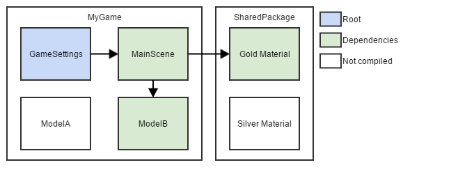

# Asset Control

Until now, all assets of a game package, and its dependencies, were compiled as part of your game.

Starting with 1.3, we compile only the assets required by your game.

Don’t worry, most of it is done automatically for you! We do that by starting to collect dependencies from the new Game Setting asset: it references the Default Scene, and we can easily detect all the required asset references (Models, Materials, Asset referenced by your scripts and so on).

In case you were loading anything in your script using Asset.Load, you can still tag those assets specifically with “Mark as Root” in the editor.

However, we now recommend to instead create a field in your script and fill it directly in the editor. All the samples have been updated to this new practice, so please check them out.

# Which assets are compiled?

Assets that will be compiled and packaged in your project are:

- **Root assets (blue)**
  - **Automatic** for a few asset types (i.e. Game Settings, Shaders)
  - Explicit (using "**Mark as Root**" on the asset)
- **Dependencies of root assets (green)**
  - Since Game Settings is collected, that means that Default Scene and all its dependencies will be compiled as well (includes Model, Script field members pointing to other assets, etc...)
  - Also, we encourage our users to switch your script from Asset.Load (which require "Mark as Root") to a field member that you can set within the editor using drag and drop. That will create an implicit dependency that will force that asset to be compiled as well.
- **Everything else (white)** (objects not marked as root and not referenced directly or indirectly by a root) **won't be packaged**

 

# Details about "Mark as Root"

One important thing to understand is that "Mark as Root" is not part of the asset, it is stored in the "current" package (the one that is in bold in the Solution explorer).

It means that if "MyGame" is current package, if you check "Mark as Root" on Silver Material (part of SharedPackage), this information will be stored in MyGame.xkpkg as part of the reference to SharedPackage.

As a result, you can use a shared package from multiple games even if you have different explicit roots.

 

