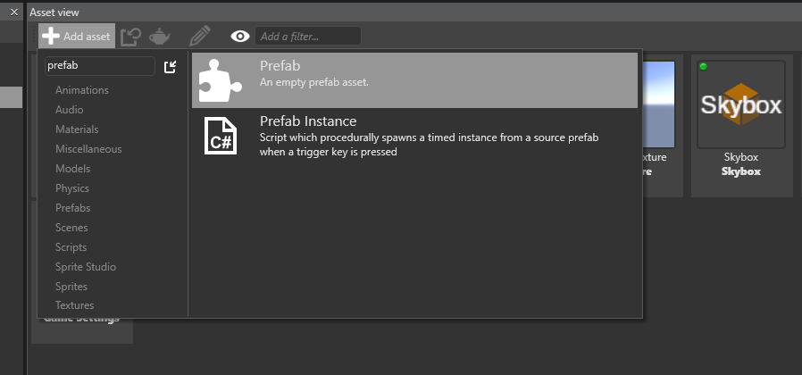
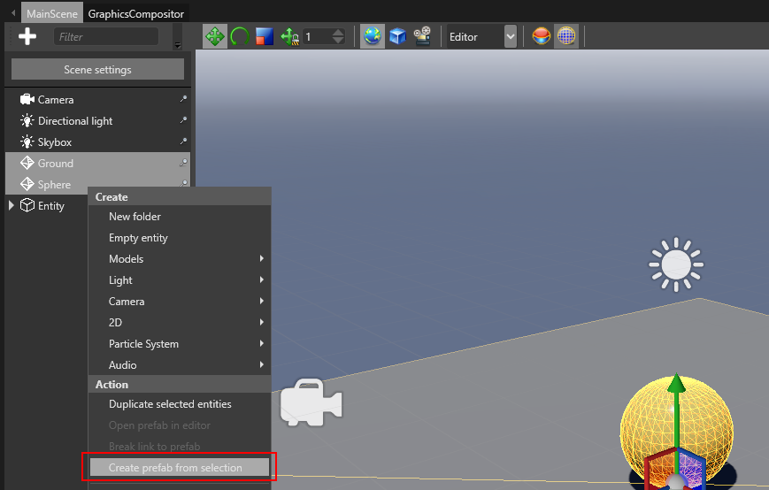

<div class="doc-incomplete"/>

# Introduction to using Prefabs

Prefabs are essentially collections of various kinds of Entities that can be re-used in your project, and need a single point where they can be configured and maintained. Prefabs are ideal to use for things like scenery and props.

## Prefabs in the Game Studio

At design time, since all instances of a prefab are based on the original prefab, changing any property or content of the prefab will cause all instances of this prefab to be altered.

You can create an empty Prefab with "Add Asset" in the Asset View:



Alternatively, you can create one from a group of entities in a scene:



Once you've created a Prefab, you can easily drag and drop the Prefab from the Asset view into the Scene editor to instantiate it, like any other Asset.

Double-clicking on the Prefab will open another Scene editor with its content, allowing you to edit it. Any changes you do will be reflected on their instances in other scenes.

## Using Prefabs from script

In order to use prefabs at runtime, you need to intantiate them. Let's assume we have a Prefab called 'MyBulletPrefab' located in the root of our project, and we want to create an instance in our scene. The code snippet below shows how this is done.

````cs
private void InstantiateBulletPrefab()
{
    // Note that "MyBulletPrefab" refers to the name and location of your prefab Asset
    var myBulletPrefab = Asset.Load<Prefab>("MyBulletPrefab");
    
    // Assume there is only one top-level entity (could be multiple)
    var bullet = myBulletPrefab.Instantiate().First();

    // Change the X coordinate
    bullet.Transform.Position.X = 20.0f;
    
    // Add the bullet to the scene
    SceneSystem.SceneInstance.Scene.Entities.Add(bullet);
}
````

At runtime, any changes done to the original prefab (`myBulletPrefab` in this example) won't be reflected on the already existing instances of this prefab (`bullet` in this example). However, subsequent calls to @'SiliconStudio.Xenko.Engine.PrefabExtensions.Instantiate(SiliconStudio.Xenko.Engine.Prefab)' will include the new changes.