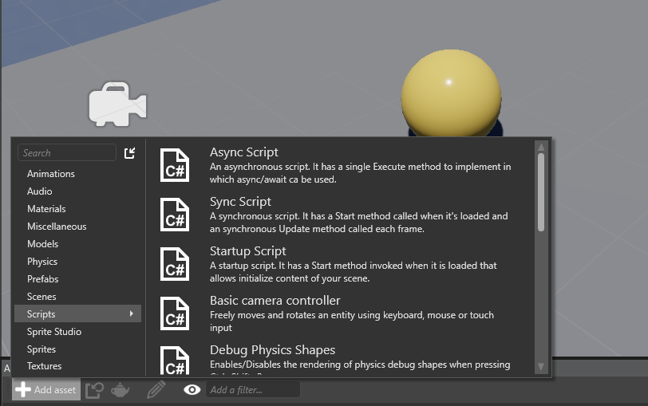
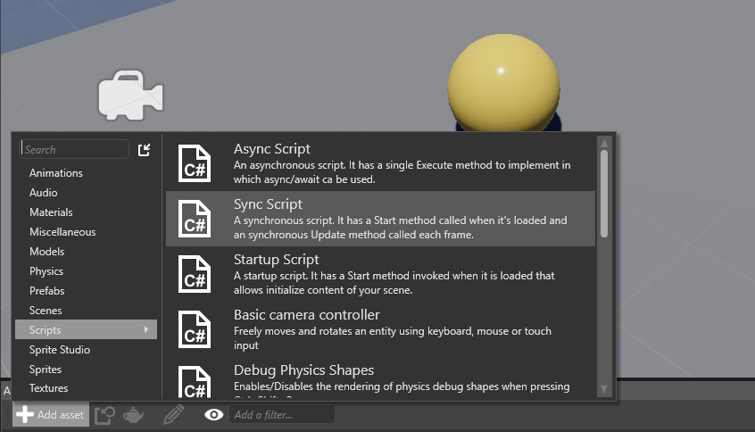
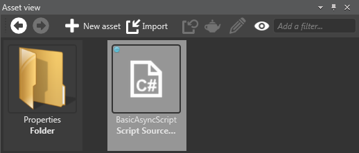

# Create a Script

<span class="label label-doc-level">Beginner</span>
<span class="label label-doc-audience">Programmer</span>

You’ve created a game and have added some entities to the game. Now, you have to add some scripts to your game to make your static game dynamic. There are two ways to add a script: In Visual Studio, and in the Game Studio. We'll describe both below.

## Create a script in Visual Studio

You can create a script in Visual Studio. On the tool bar of Game Studio, you can click the (Open in IDE) icon to open Visual Studio.

**To create a script in Visual Studio:**

1. Open Visual Studio, by clicking the 'Open in IDE' button  in the Game Studio toolbar.

2. Add a new class in the ```.Game``` extension of your project. To add a new class, right-click the ```.Game``` extension, click **Add**, and then click **New Item**.

3. In **Visual C#** items, select **Class**, and then click **Add**.

   A new class is added to your game.

4. Open the script file that you have created. Make the script is public and derive the new class from either AsyncScript or SyncScript manually and implement the needed abstract method(s). Here is an example of what your script might look like when you've done that:

```
	using System;
	using System.Text;
	using System.Threading.Tasks;
	using SiliconStudio.Core.Mathematics;
	using SiliconStudio.Xenko.Input;
	using SiliconStudio.Xenko.Engine;
	
	namespace MyGame
	{
		public class SampleSyncScript : SyncScript
		{			
			public override void Update()
			{
				if (Game.IsRunning)
				{
					// Do some stuff every frame
				}
			}
		}
	}
```

**Loading your new script in Game Studio**

Because your project has been modified outside of Game Studio, Game Studio needs to reload certain information to show your changes.

1. Save your project and script files
2. Go to the Game Studio, and select **Yes** in the displayed popup prompting you for reload of the affected assemblies.

   

   _Confirmation message_

   Game Studio adds your class script to your component list.

3. Select the Assembly you've added your script to, and you'll find your script in the Asset view window, ready to be used.

## Create a script in Game Studio

You can create a script in Game Studio without using any other application.

**To create a script in Game Studio:**

1. On the **Asset view** tab, click **New Assets**, and then click **Scripts**.

   

2. Select a script type from the **Script Types** list. The new script is added to the **Asset view** tab.

   
   _Select script type_

   

   _New script on Asset view tab_
   
```
    using System;
	using System.Text;
	using System.Threading.Tasks;
	using SiliconStudio.Core.Mathematics;
	using SiliconStudio.Xenko.Input;
	using SiliconStudio.Xenko.Engine;
	
	namespace MyGame
	{
		public class BasicAsyncScript : AsyncScript
		{	
			public override async Task Execute()
			{
				while(Game.IsRunning)
				{
					// Do some stuff every frame
					await Script.NextFrame();
				}
			}
		}
	}
```

Now, you’ve learned how to create a script in Xenko. You can use your script for an entity now. For information on how to use a script, see [Use a script](use-a-script.md).
