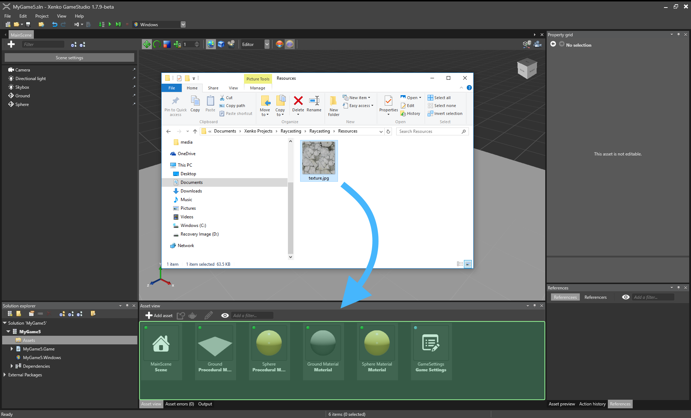

Beginner

# Create Assets

To add content to your game, you need to create assets. This page will show you how to create assets in Game Studio.

Xenko provides the following ways to create and add assets in your game:
 * Add assets from the **Asset view** tab
 * Add assets by dragging and dropping resource files (images, audio, etc.) in the **Asset view** tab
 
## Adding assets from the Asset view tab

 1. In the **Asset view** tab, click .
 
	A list of assets is displayed.

 2. Now we need to select an Asset template. An Asset template sets up certain parameters correctly for specific Asset types.
    Select an Asset template, by moving the mouse pointer over the desired Asset template type. In this sample we'll create a model by selecting 'Models':

	
 
	_Add asset from Asset view tab_

    And then selecting the specific model we'd like to add. In our case: Sphere.

	The asset is added to the **Asset view** tab.

	

	_Procedural Model added to Asset view tab_

> [!Note]
> Some Assets require a source file, such as textures. When adding these Assets, 
> you will be prompted to select the required resource file in order to continue.	

## Adding assets with drag and drop

You can also add Assets by dragging and dropping resource files directly from the Windows explorer into the **Asset view** tab:

1. Select resource file from Windows Explorer

_Select resource from windows explorer_

2. Drop resource file into Game Studio

_Drop resource in Game Studio_

3. Select the correct template from Game Studio

> [!Note] 
> When dragging and dropping multiple files of _different_ types (e.g. texture and model files), 
> only the files that match your selection in step 3 will be added. I.e.: when adding model and texture files, 
> and you select the 'Model' Asset template, only the files that are model files will be added.

Resource files that can be imported are:

* Images (png, jpg, etc.)
* Models and animations (3ds, obj, x, pbx, etc.)
* Audio files (wav, ogg, mp3, etc.)

Game Studio will automatically add all dependencies of an added resource file (e.g. a model that uses textures), so you can just drag and drop the main resource file, and Game Studio handles everything else.

Now that you’ve seen how to create and add assets to your game project, we'll show you how to customize your assets to suit your game environment. For information on editing assets, see [Manage assets](manage-assets.md).
