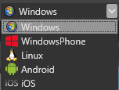
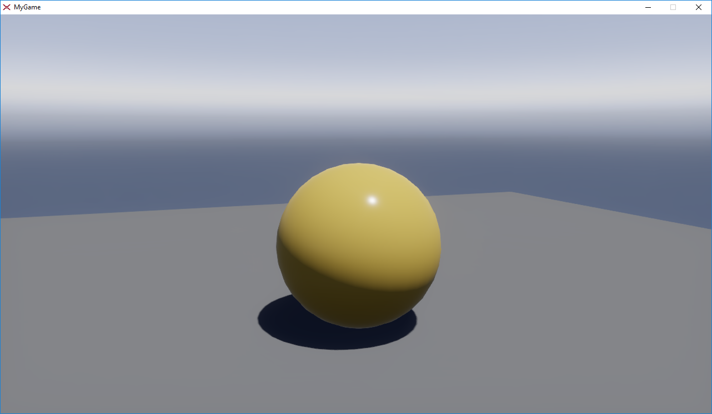

# Launch a Game

Beginner

When your game is ready, you will be curious to see what it looks like. 

This page will show you how to start your game using either the Game studio or Visual Studio.

## Launch your Game from Game Studio

  1. First select your target platform in the top bar of Game Studio.

  

  2. Click  to run or press **F5**.

  You can see the build status in the Output window. 
  When the build has finished, your game starts on the selected platform.

> [!WARNING]
> Currently it is not possible to start your Game for the **Windows Store** and **Windows 10** platforms from Game Studio.
> For those platform proceed from Visual Studio.

## Launch your Game from Visual Studio

1. Open Visual Studio by clicking on  icon in the Game Studio.

2. Identify the project corresponding to the platform you want to run your game to.

   > [!TIP]
   > You can easily identify the adequate project by looking at the final extension of the project (e.g. *.Android*, *.iOS*, etc).
   
3. Set the appropriate project as startup project.
   
   The startup project configuration at the top Visual Studio are updated automatically. 
      
	
   
4. Check that configuration and platform properly matches what you are expected.
  
5. To start the game with or without debugging:
   * Press **Ctrl + F5** to start the game without debugging
   * Click  or press **F5** to start the game with debugging.

   
   
Congratulation! You finished the get started pages. Continue your learning by reading the reference and tutorial pages.