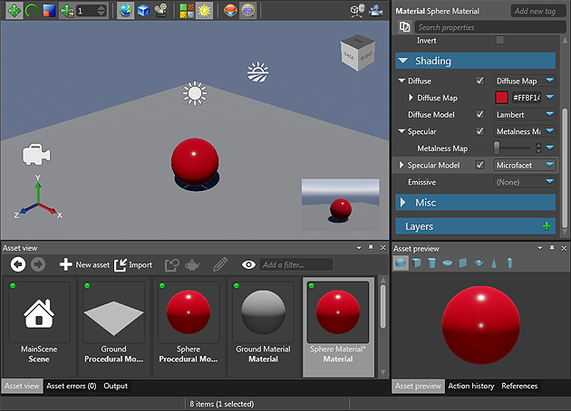
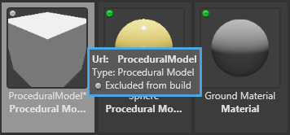
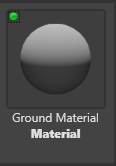
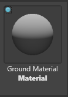

# Manage Assets

After you add an asset to your game project, you may need to make some changes to the asset in order to make it suitable to your game environment.

This page will show you how to edit your game assets. As an example, you’ll change the color of a Material.

## Change Material color

 1. In the **Asset view** tab, select the Sphere Material.
 
	

	_Sphere Material on the Asset view tab_
	
	The **Property grid** section shows the properties of the selected material.

 2. In the **Property grid** section, find the **Diffuse** property under **Shading**.
 
 3. Click the colored box indicating the current color (yellow in this example), the color picker is displayed, allowing for easy selection of the diffuse color.
 
		
 
 	_Color picker and Palette_
	
 4. Click the **Color picker** and select a red hue color or enter the hexadecimal value.
	
	After you set the color for the material, the color of the asset changes. 
	
	

	_Asset appears in new color_

> [!TIP]
> At all times, you can see your changes in real-time in the asset preview window.
	
## Organize Assets

In the Scene explorer view in the top-left of the Game Studio, you will see all the Assets that are currently contained in your scene. You can easily organize your Assets in folders, by right-clicking in the Scene explorer, and selecting 'Create Folder'. Type a name for the new folder, and press enter. Now you can simple drag and drop selected Assets in the folder, in order to create a clean and well organized project.

> [!TIP]
> Hover your mouse pointer over the asset to see the URL, Type, and other details of the asset as a tooltip.
> 
 
## Include assets in build

Assets are not included in the game data by default. They are only included in the game data, if they are referenced by another Asset included in the game data, or when they are explicitly included. By clicking the dot in the top-left of an Asset in the Asset view, you can control if an Asset is included or not. The color of the dot indicates the include status:

_Green: the Asset is included in the game data, because it was referenced or included by another Asset that is included in the game data._

_Blue: the Asset is included in the game data. Note that this Asset has not been referenced by any other Asset. A reason to include Assets this way, is for instance, if you want to use them through script._

_No color / transparant: the Asset is not included in the game data._
	
You’ve learned how to edit an asset. In the next section you'll learn how to use assets, see [Use assets](use-assets.md)
