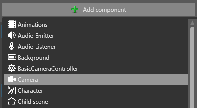
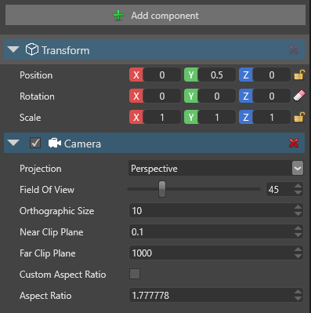

# Populate a Scene

Beginner
Level Designer

After you create a scene, you need to add entities to your scene to build your game level. 
You can add an entity to your scene in a couple of different ways.

In this page, you’ll learn how to create an entity from an asset, add a new entity in the entity hierarchy view, 
and duplicate an existing entity.

## Add an entity from the asset view

You can create a new entity in your scene by simply drag-and-dropping an asset from the *Asset view* tab in the Scene Editor. 

The following video shows how to proceed.

<video controls autoplay loop height="360" width="480">
   <source src="media/add-entities-to-scene-drag-and-place-entity.mp4" type="video/mp4">
</video>

_Video: Drag and place an entity_

When you drop the asset, the Game Studio automatically create an entity, adds the required component and the reference to the asset.

> [!NOTE]
> Only assets that have corresponding components can be added to the scene by drag-and-dropping.
> For examples: Models, Textures, Sprite Sheets or Skyboxes.

Alternatively, you can drag-and-drop the asset on an existing entity in the entity hierarchy or 
the property grid of a selected entity to add a new component without creating a new entity.

## Create an entity from the entity hierarchy view

An alternative way to add entities to your scene is to create them from the *Entity Hierarchy View*, 
and then set up their component from the property grid.

**To create an entity from the Entity Hierarchy View:**

1. Click on the  icon. 

   A context menu opens.

   

   _Context menu of MainScene_

2. Select ***Empty entity*** to create an entity free from any component, 
   or select an entity template to create an entity preset for a specific function.

   An new entity is created.

   

   _New Entity in MainScene_
   
Next step is to **add and setup a component** to your entity to add a specific function to it.
   
**To setup a component of your entity:**

1. **Select the entity** that you want to modify.

2. Click on **Add component** button from the property grid, and add the desired component (if needed).

   

   _Add new component in Property grid_

   A new component is added.

   

   _New component added in Property grid_

3. **Set the properties** of your new component.

## Duplicate an existing entity

Instead of creating a new entity, you can also start from an existing entity by duplicating it, and then modifying its properties.

**To duplicate an existing entity:**

1. Select the entity to duplicate
2. Activate the translation gizmo by clicking on the  icon.
3. Maintain the *Ctrl* button down and translate the entity along one axis.

   The entity and all its properties are duplicated.
   
<video controls autoplay loop height="360" width="480">
   <source src="media/populate-scene-duplicate-entity.mp4" type="video/mp4">
</video>

_Video: Duplicate an entity_

Alternatively you can duplicate entities using the *Duplicate selected entities* option of the context menu.

## Rename an entity

After you have duplicated an entity, Xenko assigns a default name to the duplicated entity. 

**To rename the entity:**

1.	Select the entity and press **F2**.
2.	Type a name for the entity, and then press **Enter**.

   
   
   _Renamed entity in a scene_

Now that you are able to add entities to your scene, the next step is to move, rotate and scale your entities to build a full word, 
see [Arrange entities](arrange-entities.md).
