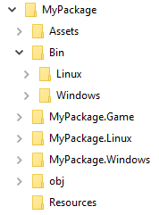

# Project Structure

Beginner

This page explains how the Game Studio organizes game projects. 
Understanding Xenko project structure is essential for knowing where to put and find files, 
team member collaboration and scaling your projects up.

## Packages

The Game Studio organizes your project into packages. 

A package is a container composed of:

* Assets: An asset is a representation of an object of your game inside the editor. 
  See [Introduction to Assets](introduction-to-assets.md) for more information.
* Resources: A resource is a data file used by an asset such as an image, a 3D model, a sound file, etc.
* Code files: The code files of your game, that is scripts, shader and effect files. 
  For more information about scripts, see [Scripting in Xenko](scripting-in-xenko.md).
* Dependencies to other packages.

A package (with its dependencies) makes up an independent block that can be reused in other games or applications.

> [!NOTE]
> A game is a package having a main executable (entry point).

## Package Directory Structure

The Game Studio creates one dedicated folder for each package of your game.
Inside each of these folders, it organizes the different files as follow (example of a package named 'MyPackage'): 

1. **Assets**: Contains all the assets of the package. The Game Studio automatically creates an asset file for each asset created inside the editor.
2. **Bin**: Contains all the binaries of your package or game. A sub-directory is created for each platform. 
   In the case of a game, it contains all the files needed to run your game on the specified platform.
3. **MyPackage.Game**: Contains all the source code of your package.
4. **MyPackage._Platform_**: It the case of a game, it contains all the platform specific source code and main entry points for the platform. 
5. **obj**: Contains all build cached files. If you want to force a complete asset and code rebuild, you can delete this folder.
6. **Resources**: This is the place where you should copy all resource files. 

> [!WARNING]
> Xenko doesn't automatically copy resource files into the dedicated resource folder, it is your job to do so. 
> We made this choice to avoid useless copies and so that you can organize your resource files as you want.
> However make sure that relative paths to the resource files are the same on all your machines.
> If not, your project won't be sharable between the different members of your team.

> [!TIP]
> Note that the directory structure matches what the Solution explorer displays inside the Game Studio.

Now that you know how to properly organize your project, you can start creating the assets of your game, see [Introduction to Assets](introduction-to-assets.md).
