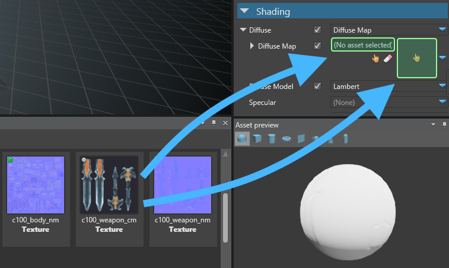
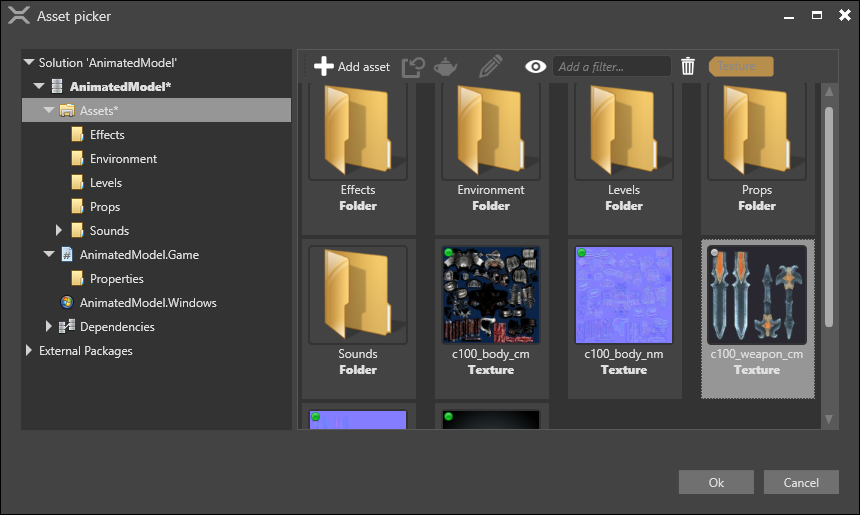
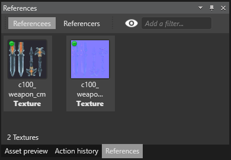

# Use Assets

<span class="label label-doc-level">Beginner</span>

This page explains you how to use the assets in your game once you've created them.

## Reference Assets

The first and most common way to use an asset is to reuse it in another of your assets by adding a reference.

Common examples are:

* Using a material in a model asset
* Using a texture in a material asset
* Referencing a model or a sprite asset in the entity components of a scene.

References are added from the property grid tab.
You can easily identify properties that need references to other assets thanks to the **asset picker** dock.
Every time you see the asset picker dock, the property is expecting an asset as input. 


_Asset Picker_

To **add a reference**:
- Directly drag-and-drop your asset onto the asset picker dock, or
  
- Click on the hand icon . This opens the asset picker. 
  Select the appropriate asset and validate.  
  
  
After the reference is added the asset picker dock displays the name and the image of the referenced asset.


> [!NOTE]
> The type of the expected asset is not explicitly specified in the property grid, 
> but the asset picker shows and lets you select only the proper asset types for the given property.

To **clear a reference** to an asset, use the eraser icon  of the asset picker dock.

To examine the reference between assets, you can use the 'References' tab at the bottom-right corner of the Game Studio.
The 'Referencees' button shows you all the asset referenced by the current selected asset and 
the 'Referencers' button shows you all the asset that the currently selected asset reference.



_References tab_

## Load Assets from code

Another way to use your assets is to load them at runtime and use them in your scripts.

To load an asset from a script use the [ContentManager](xref:SiliconStudio.Xenko.Engine.IScriptContext.Content), as shown by the code below:

```cs
// Load a model (the URL should be replace by the valid pass)
var model = Content.Load<Model>("AssetFolder/MyModel");

// Create a new entity to add to our scene
Entity entity = new Entity(position, "Entity Added by Script") { new ModelComponent { Model = model } };

// Add the new entity in the current scene
SceneSystem.SceneInstance.Scene.Entities.Add(entity);
```

The above script shows how you can load a model at runtime and add it to your scene.

> [!TIP]
> The URL used can be retrieved from Game Studio, by hovering an asset. 
> Typically it is built up like : 'AssetFolder/AssetName'

> [!WARNING] 
> When loading assets from scripts, be sure to properly include the asset in the build as described in the previous chapter.
> Also make sure to add the Script as a component to an Entity in the Scene in order to get executed.

> [!WARNING]
> When loading asset manually, you should not forget to unload the asset when you don't need them anymore.
> For this you can use the following code "Content.Unload(myAsset)".
> If you forget to do so, asset loaded manually will stay in memory the full time of your game.

Next, you'll learn how to create a Scene in Game Studio, see [Introduction to scenes](introduction-to-scenes.md)
