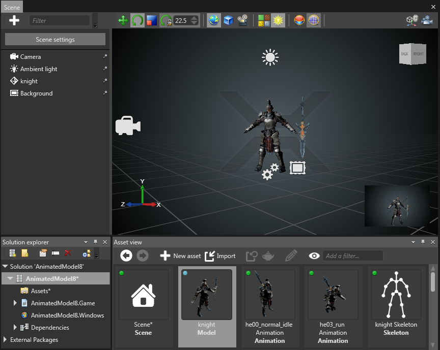

# Create a basic scene

* TODO, this chapter makes little sense, as a scene is automatically created and there is no option to create additional scenes at the moment (?)
* TODO, this chapter basically shows how to add assets to a scene, which is covered on another page
* TODO, remove page?

A scene is automically created when starting the Game studio. You can add various entities, such as models, cameras and lights to this scene.

This page will show how to create and populate a basic scene in [Game Studio] (xref:game-studio).

>**Note:** You need to create or add some [assets](xref:asset) to your game in order to populate the scene. For information about creating or importing assets, see [Create and add assets](create-and-add-assets.md).

## Add entities to a scene

You can quickly add an entity to your scene from the **Asset view** tab. Select an entity from the **Asset view** tab, drag and place the entity in the Scene Editor. For more information on how to add entities to your scene, see [Add entities to a scene](add-entities-to-a-scene.md).

   
   _Sample basic scene_

>**Note:** When you add a new entity, Game Studio adds the corresponding [components](xref:component), such as model, texture, and other entities automatically to your game. You can modify the default configurations of your entity. For information on how to configure your entities, see [Edit assets](edit-assets.md).

You’ve created a simple game. Now, you need to add entities to your scene. For information about how to add entities to a scene, see [Add entities to a scene](add-entities-to-a-scene.md).
