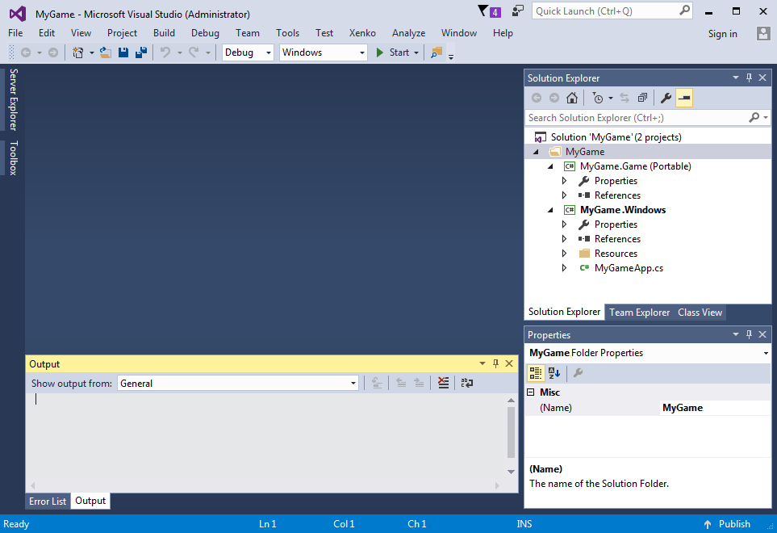
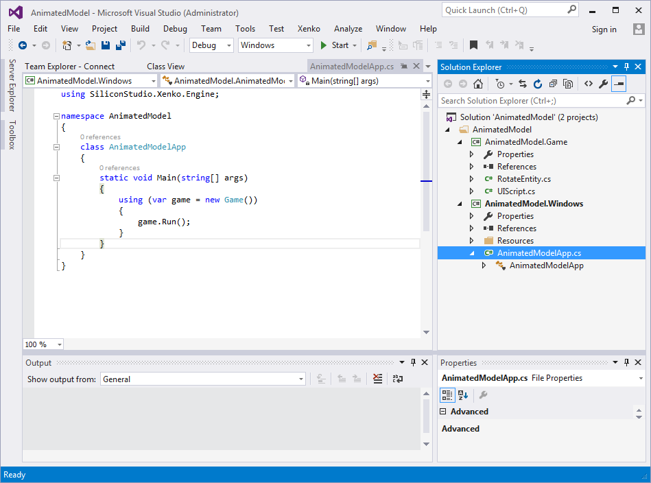
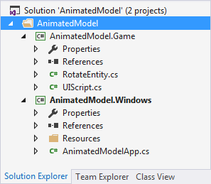
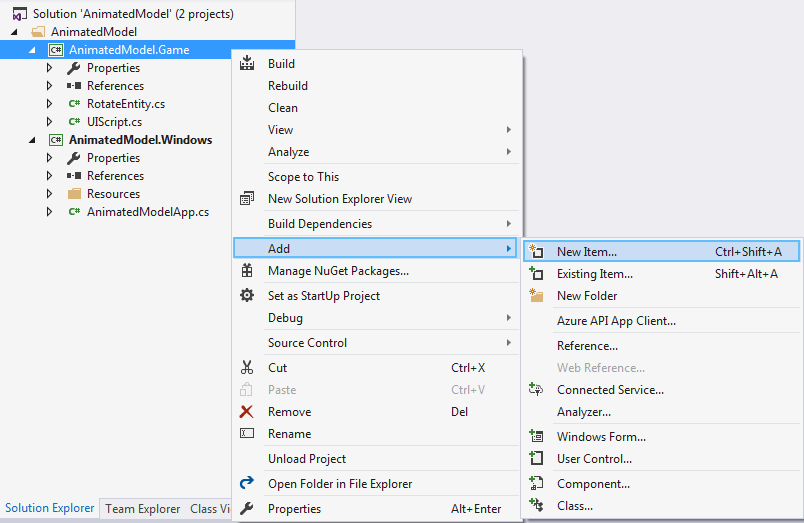
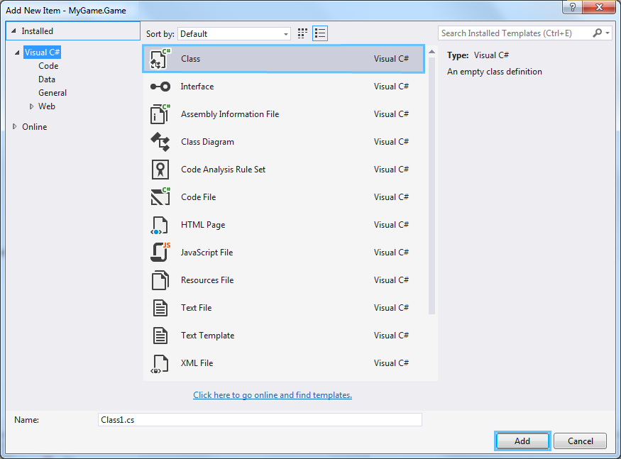
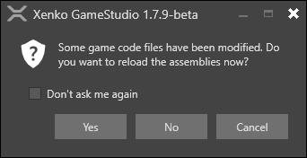
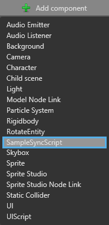
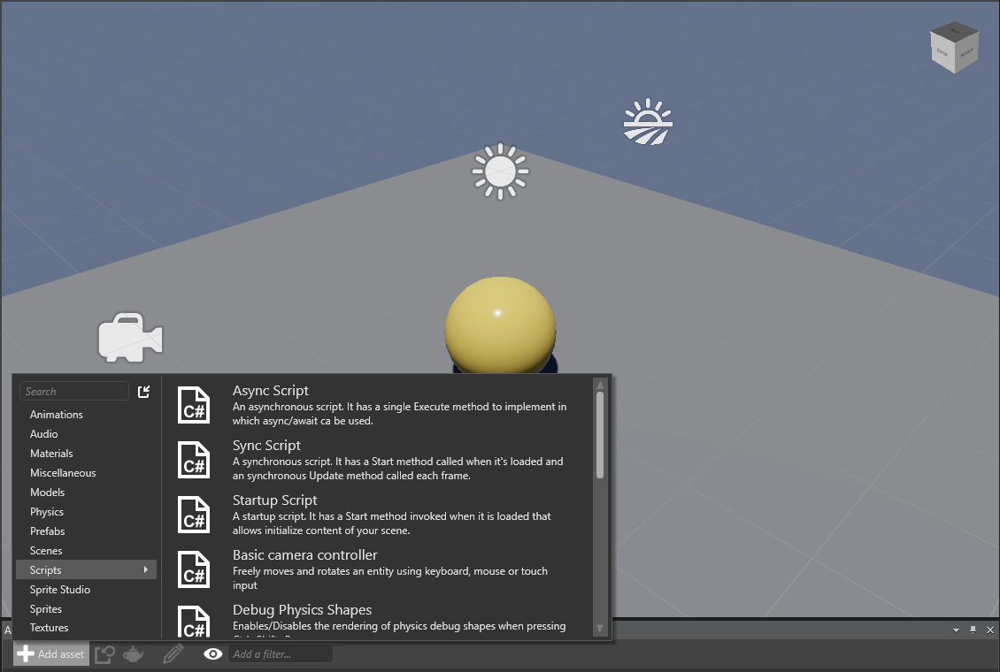
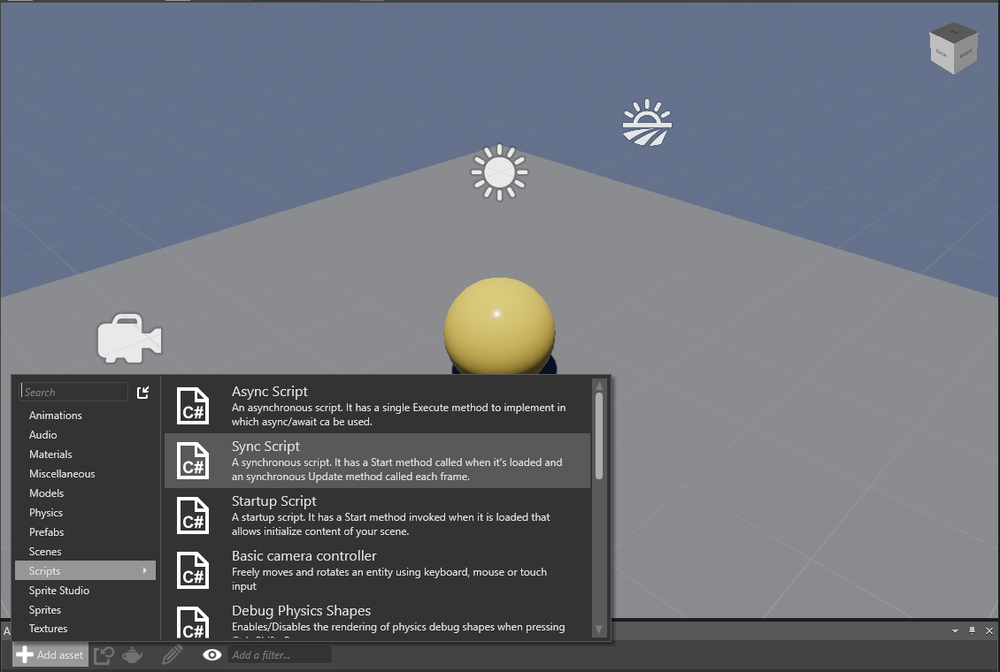

# Create a script

In this page, you’ll learn how to create a [script](xref:scripting). Xenko provides two ways to create a script: Create a script in Visual Studio and create a script in Xenko Studio.

You’ve created a game and have added some entities to the game. Now, you’ve to add some scripts to your game to make your static game dynamic. A script is a unit of code that helps to move entities, control their movement, arrange events in your game, and respond to user inputs.

>**Note:** The scripts that you create can access the entire set of APIs created by the Xenko [Game Engine](xref:game-engine) for various purposes.

## Open your project in Visual Studio

You can open your existing project in Visual Studio using the Game Studio interface.

**To open a project in Visual Studio:**

1. Open Game Studio.
2. Click the  (Open in IDE) icon displayed below the Menu bar.

   The project is opened in Visual Studio.

   

   _Project opened in Visual Studio_

## Create a script in Visual Studio

You can create a script in Visual Studio. On the tool bar of Game Studio, you can click the (Open in IDE) icon to open Visual Studio.

**To create a script in Visual Studio:**

1. In the Visual Studio application, open the project.

   

   _Visual Studio application_

   The game in Visual Studio by default creates two extensions: ```.Game``` and ```.Windows```.

   

   _Game extensions in Visual Studio_

2. Add a new class in the ```.Game``` extension of your project. To add a new class, right-click the ```.Game``` extension, click **Add**, and then click **New Item**.

   

   _Create a new class_

   The **Add New Item** window opens.

   

   _Add New Item window_

3. In **Visual C#** items, select **Class**, and then click **Add**.

   A new class is added to your game.

4. Open the class that you have created. Make the script public and assign the type of script (AsyncScript or SyncScript) manually. Add a function to the code. The following is a code snippet that shows you how to rotate an entity around its Y-axis.

```
	using System;
	using System.Collections.Generic;
	using System.Linq;
	using System.Text;
	using System.Threading.Tasks;
	using SiliconStudio.Core.Mathematics;
	using SiliconStudio.Xenko.Input;
	using SiliconStudio.Xenko.Engine;
	
	namespace MyGame
	{
		public class SampleSyncScript : SyncScript
		{			
			public override void Update()
			{
				//do stuff every new frame
				if (Game.IsRunning)
				{
					Entity.Transform.Rotation = Quaternion.RotationY((float)Game.UpdateTime.Total.TotalSeconds);              
				}
			}
		}
	}
```

5. From the **Build** menu, click **Build Solution** to build the current project.
6. After the build is successful, open your game in Game Studio, and then reload your project. To reload your project, in the **File** menu, click **Reload Project**.

   The following confirmation message is displayed.

   

   _Confirmation message_

7. Click **Yes**.

   Xenko adds your class files to your [component](xref:component) list.

8. Select your entity. In the **Priority grid** section, click **Add component**, and then select the class that you created.

   

   _Add script in Add component_

## Create a script in Game Studio

You can create a script in Game Studio without using any other application.

**To create a script in Game Studio:**

1. On the **Asset view** tab, click **New Assets**, and then click **Script Source Code**.

   

   _New asset button on Asset view tab_

	The **Script Asset Selection** window opens.

   

   _Script Asset Selection window_

2. Select a script type from the **Script Types** list. The new script is added to the **Asset view** tab.

   

   _New script on Asset view tab_

>**Note:** The new script with the selected script-type will be automatically added to Visual Studio.

```
    using System;
	using System.Collections.Generic;
	using System.Linq;
	using System.Text;
	using System.Threading.Tasks;
	using SiliconStudio.Core.Mathematics;
	using SiliconStudio.Xenko.Input;
	using SiliconStudio.Xenko.Engine;
	
	namespace MyGame
	{
		public class BasicAsyncScript : AsyncScript
		{	
			public override async Task Execute()
			{
				while(Game.IsRunning)
				{
					//do stuff every new frame
					Entity.Transform.Rotation = Quaternion.RotationY((float)Game.UpdateTime.Total.TotalSeconds);
					await Script.NextFrame();
				}
			}
		}
	}
```

>**Tip:** You can edit the new script in the text editor. To edit the new script, right-click the script in the **Asset view** tab and then click **Open in Text Editor**. Update the script and then save.

Now, you’ve learned how to create a script in Xenko. You can use your script for an entity now. For information on how to use a script, see [Use a script](use-a-script.md).