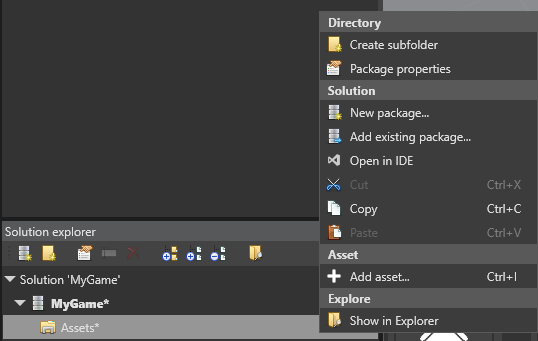

# Create and add assets

To add content to your game, you need to create [assets](xref:asset). An asset is a representation of an object of your game inside the Game Studio, such as a character of your game, environment of your game, a sound, or an animation.

This page will show you how to create new assets and add assets in [Game Studio](xref:game-studio).

Xenko provides the following ways to create and add assets in your game:
 * Add assets from the **Asset view** tab
 * Add assets from the **Solution explorer** section
 
##Adding assets from the Asset view tab

 1. On the **Asset view** tab, click .
 
	A list of assets is displayed.

 2. Click an asset, for example, [Procedural Model](xref:procedural-model).

	
 
	_Add asset from Asset view tab_

	The asset is added to the **Asset view** tab.

	

	_Procedural Model added to Asset view tab_

##Adding assets from the Solution explorer

You can choose and add an asset also from the **Solution explorer** section. To add an asset from the **Solution explorer** section, in **Solution explorer** > right-click **Assets** > click **Create** > click an asset type. The selected asset is added to the **Asset view** tab.

After the asset is added to the **Asset view** tab, move your mouse pointer over the asset to see the URL, Type, and other details of the asset as a tooltip (for example, material, @texture, [sky box](xref:sky-box), and other details).
	
  
	
   _Details of new asset in Asset view tab_
	
	
You’ve learned how to create and add assets to your game project. You may want to customize the assets to suit your game environment. For information on editing assets, see [Edit assets](edit-assets.md).
