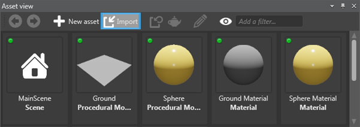
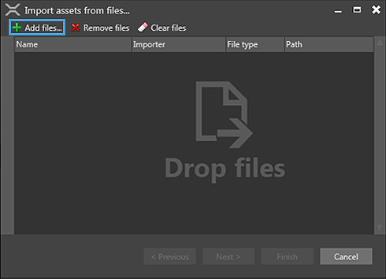
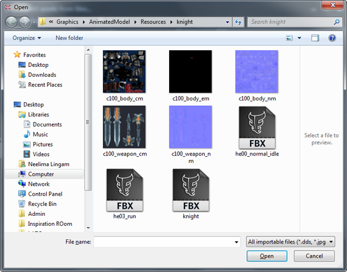
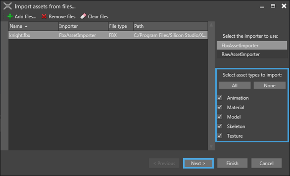
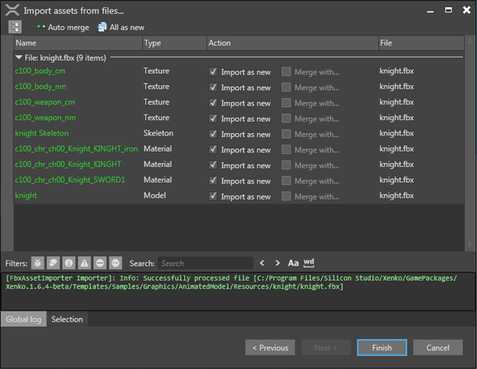

# Create and import assets

To add content to your game, you need to create [assets](xref:asset). An asset is a representation of an object of your game inside the Game Studio, such as a character of your game, environment of your game, a 3D image, a sound, and an animation.

In this page, you’ll learn how to create new assets and import assets in [Game Studio](xref:game-studio).

Xenko provides the following ways to create and import assets in your game:
 * Add assets from the **Asset view** tab
 * Add assets from the **Solution explorer** section
 * Import assets from a file
 
## Add assets from Asset view tab

To start with, you can add a basic asset from the **Asset view** tab. Later, you can customize the asset according to your requirement.

**To add an asset from the Asset view tab:**

 1. On the **Asset view** tab, click .
 
	A list of assets is displayed.

 2. Click an asset, for example, [Procedural Model](xref:procedural-model).

	
 
	_Add asset from Asset view tab_

	The asset is added to the **Asset view** tab.

	

	_Procedural Model added to Asset view tab_

After the asset is added to the **Asset view** tab, move your mouse pointer over the asset to see the URL, Type, and other details of the asset as a tooltip (for example, material, @texture, [sky box](xref:sky-box), and other details).
	
  
	
   _Details of new asset in Asset view tab_
	
	
You can modify the properties of the asset as per your project requirements through the **Property grid** section. For more information on how to edit an asset, see [Edit assets](edit-assets.md).

>**Note:** You can choose and add an asset also from the **Solution explorer** section. To add an asset from the **Solution explorer** section, in **Solution explorer** > right-click **Assets** > click **Create** > click an asset type. The selected asset is added to the **Asset view** tab.

## Import assets

Some types of assets, such as textures, models, and sounds depend on the data files created from other software. In that case, Xenko can automatically create assets from the source data files. This process is called an import.

>**Note:** Input files such as models can depend on other data files such as textures. In that case, Xenko accordingly creates the needed sub-assets.

The following table displays the file formats that can be imported into the Game Studio.

File format	| Supported formats
------------|--------------
3D model	|FBX, DAE, OBJ, DXF, 3DS, BLEND, X, MD2, MD3
Image	|DDS, PNG, BMP, TARGA, TIFF, JPG, GIF
Sound	|Any format

>**Note:** Game Studio is easily extensible. That means, if you need to work with a custom file format, you can write your own compiler to support it.

**To import assets from a file:**
 1. On the **Asset view** tab, click .

	

	_Asset view tab_
	
	The **Import assets from files** window opens.
	
	

	_Import assets from files window_

 2. Click .

	A file explorer window opens. The following image displays a sample file explorer window.
	
	
 
	_File explorer window_

 3. In the file explorer window, type the path of an asset file in the **File name** text box, and then click **Open**.
 
	The asset file is added to the **Import assets from files** window.
	
	>**Note:** Alternatively, drag an asset file from the file explorer window to the **Asset view** tab.

	This step directly adds the asset to the **Asset view** tab.

	

	_Select asset types to import_

 4. Select the asset types that you want to import, and then click **Next**.
	
    >**Note:** When importing a resource, all its dependencies can also be automatically imported. You can select all or choose the required types.
    
	In the **Import assets from files** window, the components of the selected asset types are displayed to import.

	
	_Components of selected asset types_

  >**Note:**
    * You can select the **Import as new** check box, if you want to import the components as new assets.
	* The **Merge with** check box is available for a component only when the same component is already available on the **Asset view** tab. If you select the **Merge with** check box for a component, the new component’s properties get merged with the properties of the existing component. You can use this option in a scenario, for example, when you’ve already created materials in your game to use for your current model, and you want to use the materials instead of creating new materials.

 5. Click **Finish**.
 
	The selected assets are imported to your game project. You can see the imported assets on the **Asset view** tab.

You’ve learned how to create and import assets to your game project. You may want to customize the assets to suit your game environment. For information on editing assets, see [Edit assets](edit-assets.md).
