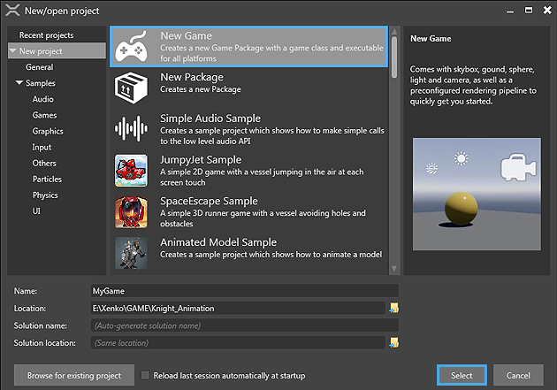
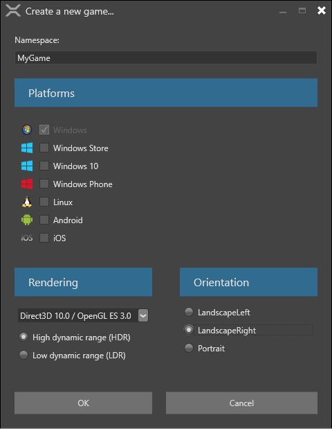

# Create a project

To start developing your game or application, you must first create a [project](xref:project).

This page will show you how to create a new empty project, and how to create a project based on a template or sample. Templates are projects that contain just the necessary elements to start working on a specific type of game. Samples are complete games, on which you can base your game, or use to learn from.

## Create or open a project dialog

To create a new game, first you have to open the **New/open project** dialog.

* To open the **New/open project** dialog from the **Xenko launcher**, click the Start button.
* To open the **New/open project** dialog from the **Game Studio**, click File > New.

_New/open project dialog_

## Create a new project

By using the 'New Game' template, basic elements like a skybox, ground, light, camera and a sphere are automatically added to the project to help you get started.

 1. Select **New Game** from the **New/open project** dialog
    
	In the bottom part of the dialog, the name and location of the project can be specified.

 2. Click **Select**.
    
	The **Create a new game** dialog opens. This dialog helps you configure your new project.
    
 

 _Create a new game dialog_

 3. Enter a value for the **Namespace** you'd like to use, or leave unchanged if you're happy with the given suggestion.
 
 >**Note:** If you're not familiar with Namespaces, please refer to the [Introduction to scripting section](introduction-to-scripting.md). For now it's fine to leave this at it's default value.

 4.	Select the platform(s) you want to develop for from the **Platforms** section. If your development system does not have the required prerequisites installed for any of the selected platform, a warning message is displayed.
    >**Note:** To run your game on iOS and Android, you need to install [Xamarin](https://www.xamarin.com/studio) (free if you have Visual Studio).

 5. Select the desired options from the **Rendering** section.
   
    5.a. **Graphics API:** The graphics that you can use in your game  are dependent on the API that you select. For advanced graphic features, select the latest version of the graphics APIs.
    >**Note:** Some graphics cards do not support the latest APIs. For some mobile devices, only DirectX 9.3 / OpenGL ES 2.0 and DirectX 10.0 / OpenGL ES 3.0 are available.

	5.b. **High / low dynamic range (HDR / LDR):** This defines the way color is computed in your game. In LDR mode, colors range from 0 to 1. In HDR mode colors can take any float value. HDR enables you to have advanced and more realistic rendering in your game but is heavier and requires at least profile DirectX 10.0 / OpenGL ES 3.0.
 6. Select the desired orientation for your game in the **Orientation** section. For PC games, use landscape. Portrait is suitable for mobile-based games.

 7. Click **OK**. 

## Create a new project from a sample

You may want to learn about a specific feature or you may want to create a game similar to the sample; Xenko provides two types of samples:

 * Feature specific basic samples: To explore and learn about a specific feature.
 * Advanced and complete games: Two complete games to create similar games from.
    
**To create a project using a sample:**

 1. Open the **New/open project** dialog.
    
 2.	The left side of the dialog shows a tree of available project templates and samples. Navigate to New project > Samples
 
 2. Select the sample you'd like your project to be based on. 
    
   

    _New/open project window - samples_

 3. Click **Select**.

    
    
    _Select Platforms window_
	
 4. Select one or multiple platforms from the **Platforms** section.

 5.	Click **OK**. 

A new game is created and opened in the **Game Studio**. Your project is now ready to be used. For more information on how to continue to add content to your project in game studio, see [Game Studio](game-studio.md).
