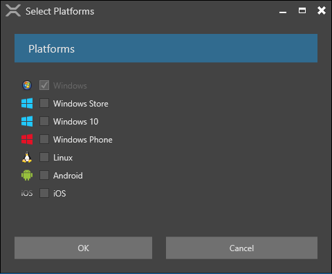

# Create a project

To start developing your game or application, you must first create a [project](xref:project).  A game project is mainly composed of [assets](xref:asset) for the game and code for the gameplay. 

In this page, you’ll learn how to create a new project in Xenko. 

In Xenko, you can start creating a project in two ways, from a new empty project, and from an existing sample.

## Open New/open project window

To create a new game, first you have to open a **New/open project** window, which guides you further to create games.

To open a **New/open project** window, on the **Xenko launcher**, click the Start button.

>**Note:** You can open the New/open project window from Game Studio, by clicking File > New.

The **New/open project** window opens. 

_New/open project window_

## Create a new project

To create a new game from scratch, you need to Create a new project. With this, a new game is created with all the minimum elements that are needed for a game. 

**To create a new game:**

 1. Open **New/open project** window, and then select **New Game**.
    
	The right side of the **New/open project** window, displays a summary of the selected project along with a preview. In the bottom part of the window, the name and location of the project can be specified.

 2. Click **Select**.
    
	The **Create a new game** window opens. This window helps you configure your new project.
    
 

 _Create a new game window_

 3. Enter a value for the **Namespace** you'd like to use, or leave unchanged if you're happy with the given suggestion.
 4.	Select the platform(s) you want to develop for from the **Platforms** section. If your development system does not have the required prerequisites installed for any of the selected platform, a warning message is displayed.
    >**Note:** To run your game on iOS and Android, you need to install [Xamarin](https://www.xamarin.com/studio) (free if you have Visual Studio).

 5. Select the desired options from the **Rendering** section.
   
    5.a. **Graphics API:** The graphics that you can use in your game  are dependent on the API that you select. For advanced graphic features, select the latest version of the graphics APIs.
    >**Note:** Some graphics cards do not support the latest APIs. For mobile devices, only DirectX 9.3 / OpenGL ES 2.0 and DirectX 10.0 / OpenGL ES 3.0 are available.

	5.b. **High / low dynamic range (HDR / LDR):** This defines the way color is computed in your game. In LDR mode, colors range from 0 to 1. In HDR mode colors can take any float value. HDR enables you to have advanced and more realistic rendering in your game but is heavier and requires at least profile DirectX 10.0 / OpenGL ES 3.0.
 6. Select the desired orientation for your game in the **Orientation** section.
    >**Note:** For PC games, use landscape. Portrait is suitable for mobile-based games.

 7. Click **OK**. 

A new game is created and opened in [Game Studio](xref:game-studio).

## Create a new project from an existing sample

You may want to learn about a specific feature or you may want to create a game similar to the sample; Xenko provides two types of samples:

 * Feature specific basic samples: To explore and learn about a specific feature.
 * Advanced and complete games: Two complete games to create similar games. 

**To create a project using a sample:**

 1. Open the **New/open project** window.
    
 2.	The left side of the window shows a tree of available project templates and samples. Navigate to New project > Samples
 
 2. Select the sample you'd like your project to be based on. 
    
	The following is image displays selecting a game sample in **New/open project** window.
 
   

    _New/open project window - samples_

	>**Note:** As an example, a JumpyJet Sample is selected. The right panel of the window displays a summary of the game selected and a preview of the game.
 3. Click **Select**.

    The **Select Platforms** window opens.
    
    
    
    _Select Platforms window_
	
 4. Select a platform from the **Platforms** section.
    If your system does not have a particular platform installed, a warning message is displayed.

 5.	Click **OK**. 

A new game is created and opened in the **Game Studio**. Your project is now ready. For more information on how to continue to add content to your project in game studio, see [Game Studio](xenko-studio.md).
