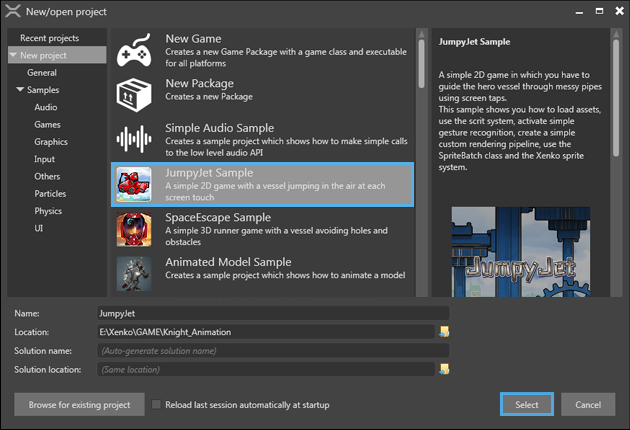

# Create a project

To start developing your game or application, you must first create a [project](xref:project).  A game project is mainly composed of [assets](xref:asset) for the game and code for the gameplay. 

In this page, you’ll learn how to create a new project in Xenko. 

In Xenko, you can start creating a project in two ways, from a new empty project, and from an existing sample.

## Open New/open project window

To create a new game, first you have to open a **New/open project** window, which guides you further to create games.

To open a **New/open project** window, on the **Xenko launcher**, click the Start button.

_Start button of Xenko launcher_

>**Note:** Later, you can open the New/open project window from Game Studio as well by clicking File > New.

The **New/open project** window opens. 

_New/open project window_

## Create a new project

To create a new game from scratch, you need to Create a new project. With this, a new game is created with all the strict minimum elements that are needed for a game. 

**To create a new game:**

 1. Open **New/open project** window, and then select **New Game**.
    
	The right side of the **New/open project** window, displays a summary of the selected project along with a preview. 
    >**Note:** You can type the name and location of your game in the respective fields. The solution name and location can be usually assumed by the application and need to be specified.

 2. Click **Select**.
    
	The **Create a new game** window opens. This window helps you configure your new project.
    

 _Create a new game window_

 3. Type a name that can be used for your code sources in the **Namespace** box.
 4.	Select the platform that supports your game from the **Platforms** section. If your system does not have the requirements for a platform installed, a warning message is displayed.
    >**Note:** To run your game on iOS and Android, you need to install [Xamarin](https://www.xamarin.com/studio) (free if you have Visual Studio).

 5. Select the configurations for graphic API and colors from the **Rendering** section.
   
    5.a. **Graphic API:** The graphics that you can use in your game  are dependent on the API that you select. For advanced graphic features, select the latest version of graphic API.
    >**Note:** Some of the graphic cards do not support the latest APIs. For mobile devices, restrict the selection to profile 9_3 or profile 10_0.

	5.b. **Colors:** This defines the way color is computed in your game. In LDR mode, colors range from 0 to 1. In HDR mode colors can take any float values.  HDR enables you to have advanced and more realistic rendering in your game but is heavier and requires at least profile 10_0.
 6. Select the desired orientation for your game in the **Orientation** section.
    >**Note:** For PC games, use landscape. Portrait is suitable for mobile-based games.

 7. Click **OK**. 

A new game is created and opened in [Game Studio](xref:game-studio).

## Create a new project from existing sample

You may want to learn about a specific feature or you may want to create a game similar to the sample; Xenko provides two types of samples:

 * Feature specific basic example: To explore and learn about a specific feature.
 * Advanced and complete game: Two complete games to create similar games. 

**To create a project using sample:**

 1. Open the **New/open project** window.
    
	The left panel of the window has an option Samples to open the required sample to be created. 
 2. Select the sample. 
    
	The following is image displays selecting a game sample in **New/open project** window.
 
   

    _New/open project window - samples_

	>**Note:** As an example, a JumpyJet Sample is selected. The right panel of the window displays a summary of the game selected and a preview of the game.
 3. Click **Select**.

    The **Select Platforms** window opens.
    
    
    
    _Select Platforms window_
	
 4. Select a platform from the **Platforms** section.
    If your system does not have a particular platform installed, a warning message is displayed.

 5.	Click **OK**. 

A new game is created and opened in the **Game Studio**.

>**Note:** An empty package can also be created to share assets and source code between projects. A package is a library of components, such as assets and scripts. A package is not an executable file like a game, but a container of files that can be shared among various projects along with its components.

Your project is now ready. For more information on how to create a project in game studio, see [Game Studio](xenko-studio.md).
