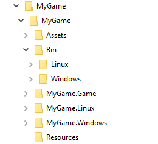

# Game project structure

A proper project organization is an important aspect of any game project. By learning how a Xenko project is organized, you can optimize your game development effort, time, and asset utilization.

In this page, you'll learn how a Xenko project is organized.

## Directory structure

In Xenko, a @project refers to a game project. A Xenko project folder comprises of various sub-folders. Various project components are placed in the respective folders for easy access.  Each game is contained in a @package. In [Game Studio](xref:game-studio), the Solution explorer section displays the hierarchy of your game. [Assets](xref:asset) are the objects used in your game. [Resources](xref:resources) are images, textures, and @entity images used in your game.

For example, for a project named 'MyGame', the directory structure is as follows:

1. **Assets** Contains all the assets used in the project. (Models, materials, etc.)
2. **Bin** Contains the binary (compiled) files needed to run the game on the respective platform. A subdirectory for each platform is created, and contains the files needed to run on that platform.
3. **MyGame.Game** Contains all the game specific source code.
4. **MyGame.Windows** Contains all the platform specific source code (in this case for Windows). A subdirectory containing the platform name is created for every selected platform.
5. **Resources** Contains all resources. Resources are the files containing the raw information that needs to be embedded in the game, like: images, audio, FBX files, XML files, etc.

Now, as you know how to organize your project, you can start creating your own assets. For more information about assets, see [Asset creation](asset-creation.md).
