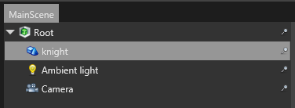
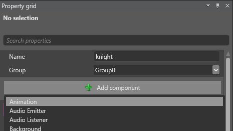
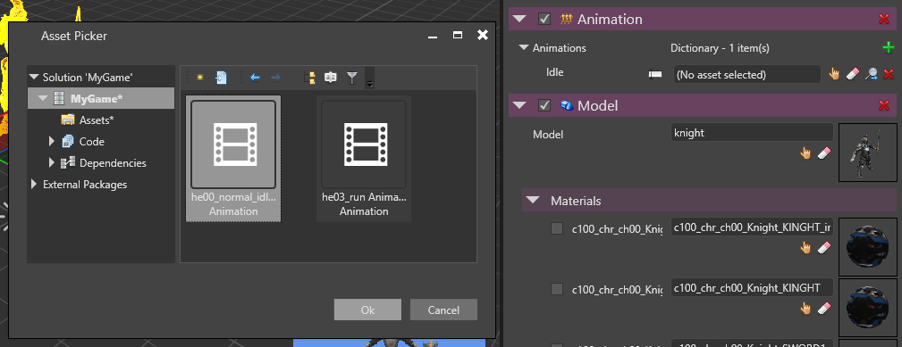
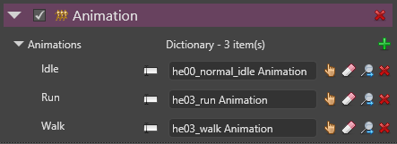
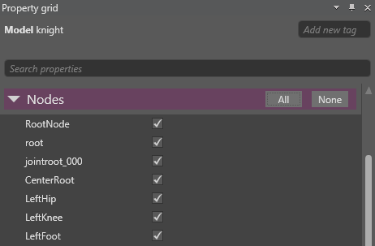

# HOWTO: Animate a model

Now that you know how to make and use **scripts** lets see how you can use them to easily **animate your models** !

# Setup the animation

Before being able to play a animation, you should first **specify the list of animations** available for the entity.

Start by **opening your scene**.

Then **select the entity** you want to add animations to (this entity should contain a model on which to apply the animation).

 

**Add an animation component** to the entity.

 

**Add a new entry** to the dictionary of animations.

You are then prompted to add a key name, **enter the name you want to give to the animation**.

 

Then **pick the animation asset** corresponding the name you just entered.

 

Finally repeat the process until you have added all the animations that you want available at run-time.

 

 

### Important Notice:

When adding an animation on a model you should first check that the sub-nodes of the model are correctly exported to run-time.

For that, select your model asset in the asset view and check that the nodes in the property grid are correctly checked.

 

If model nodes are not checked, the build system considers that the node information is not needed for the model and merges all the sub-meshes for performances reasons. In this case, animations cannot be properly applied and will be buggy or completely ignored.

# Play the animation

Now that we have the entity animations properly setup, we can **play them on run-time**.

For that, the easiest way to do is to use **scripts**. 

First, **assign a script to the entity** containing the animation component.

Then, inside the script, retrieve a reference to the component and **call either the @'SiliconStudio.Xenko.Engine.AnimationComponent.Play' or @'SiliconStudio.Xenko.Engine.AnimationComponent.Crossfade' functions**.

The **@'SiliconStudio.Xenko.Engine.AnimationComponent.Play'** function starts playing the new animation without performing any transitions. It is generally used to play the first animation.

The **@'SiliconStudio.Xenko.Engine.AnimationComponent.Crossfade'** function does the same but performs a smooth transition between the old and the new animation.

Here is a sample script that shows you how you can start playing a default animation for an entity and perform simple animation crossfading when touching the screen.

**Code:** Animation script sample

```cs
public class AnimationScript : SyncScript
{
    // Note: making those two field public allows you to override 
    // the default animation names from the editor for each instance of the script
    public string DefaultAnimation = "Idle";
    public string AlternativeAnimation = "Run";

    private string currentAnimation;

    public override void Start()
    {
        base.Start();
 
		// Start the default animation here
        currentAnimation = DefaultAnimation;
        Entity.Get<AnimationComponent>().Play(currentAnimation);
    }

    public override void Update()
    {
		// Perform crossfading between the two animations when user touch the screen
        if (Input.PointerEvents.Any(e => e.State == PointerState.Up))
        {
            currentAnimation = currentAnimation == DefaultAnimation ? AlternativeAnimation : DefaultAnimation;
            Entity.Get<AnimationComponent>().Crossfade(currentAnimation, TimeSpan.FromMilliseconds(100));
        }
    }
}```


