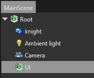

# HOWTO: Create an UI

Now that we know the basics to create a game, let's see how we can **add an UI** (User Interface) to our game.

# Setup the component

As models or sprites, **UI is just a component** that can be set to entities.

Starts by **opening your scene**. 

**Add an entity** that will be in charge of displaying the UI.

 

**Add a UI component** to the entity.

 

Ensure that the *Full Screen* property is checked, so that your UI is displayed on full screen.

Set the desired size of your UI canvas using the *Virtual Resolution* property.

For details about the other parameters, see the UI specific documentation.

### Important notice

The transformation of the UI entity directly affects the UI display.

It has been designed this way so that you easily perform UI transition effects (sliding, expanding, etc...).

The consequence is that you should be careful about the entity you add the full screen UI component to. It should not be on a entity that is intended to move into the scene.

# Setup the UI layout

Now that we added an UI element in our scene, **let's define the layout of our UI**.

In current version of the engine, it has to be done by code (a UI editor will be available in future).

Then, the easiest way to create an UI is to **use scripts**.

**Create a new script** in your game project.

Use the @'SiliconStudio.Xenko.Engine.Entity', to **retrieve a reference to the @'SiliconStudio.Xenko.Engine.UIComponent'**.

Create your layout by **building a hierarchy of @'SiliconStudio.Xenko.UI.UIElement'**.

**Set the @'SiliconStudio.Xenko.Engine.RootElement' property** of the UI component to the newly created hierarchy.

Here is a simple sample script, showing how to proceed in details.

**Code:** UI script sample

```cs
using SiliconStudio.Xenko.Engine;
using SiliconStudio.Xenko.Graphics;
using SiliconStudio.Xenko.UI;
using SiliconStudio.Xenko.UI.Controls;
using SiliconStudio.Xenko.UI.Panels;

namespace MyGame
{
    public class MyUIScript : Script
    {
        public override void Start()
        {
            base.Start();

            // retrieve UI component of the entity 
            var uiComponent = Entity.Get<UIComponent>();

            // define the layout UI by setting the root element
            uiComponent.RootElement = CreateLayout();
        }

        // Create the UI layout. Returns the root of the hierarchy
        public UIElement CreateLayout()
        {
            // Create a simple UI composed of two buttons arranged in a stack panel.
            var font = Asset.Load<SpriteFont>("MyFont");
            var firstButton = new Button {Content = new TextBlock {Text = "First Button", Font = font}};
            var secondButton = new Button {Content = new TextBlock {Text = "Second Button", Font = font}};
            var root = new StackPanel {HorizontalAlignment = HorizontalAlignment.Left, Children = {firstButton, secondButton}};

            return root;
        }
    }
}```


 

Finally do not forget to **add your script to the scene UI entity** (see [HOWTO: use scripts](howto-use-scripts.md) for more details about this stage).

 

