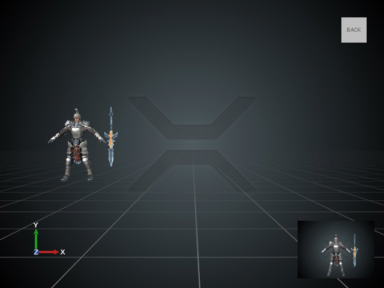
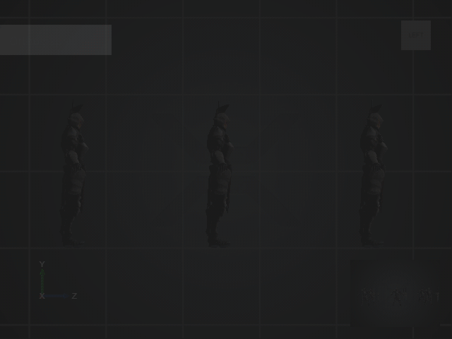
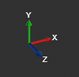
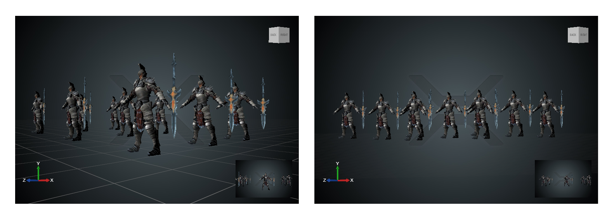

# Navigate in a scene

* TODO: CONDENSE
* TODO: MOVE UNRELATED TOPICS TO DIFFERENT LOCATION
* TODO: CREATE DEDICATED PAGE FOR FOCUS RELATED ACTIONS

When building scenes of your game in the [Scene Editor](xref:scene-editor), you need to move around a scene to accurately place and assemble [entities](xref:entity) together.

In this page, you’ll learn how to quickly and easily navigate in the Scene Editor as well as use the navigation controls, navigation [gizmos](xref:gizmo), and [editor camera](xref:editor-camera) settings.

Xenko offers you various inbuilt keys, mouse-clicks, and key combinations using which, you can focus on an entity as well as on a material, walk and fly in a scene, perform orbital rotations, change camera view angle, switch projection modes, and set camera orientation.

## Navigation controls

[Game Studio](xref:game-studio) provides you with inbuilt navigation keys, mouse-clicks, and key combinations that help you easily move inside a scene.

### Focus on an entity

While editing the properties of a specific entity, you may need to view it in a full screen mode so that you can properly see all the subtle changes that you have made to that entity. To do this, you can press the **F** key (F for Focus) on your keyboard after selecting the entity. This action automatically zooms on the entity and adjusts the position of the editor camera.

Alternatively, you can click  from the Entity Hierarchy view to focus on the entity without having to select it first.

The following animations display focusing on an entity using the Magnifier icon and using the **F** key, respectively.

  

   
   </video>
   
_Focus on an entity using Magnifier icon_

   

   

   
   </video>
   
_Focus on an entity using F key_

   

### Focus on a material

When you edit a specific material, you need to focus on that material to see the details.

**To focus on a material:**

1. On the top of the Scene Editor, click  to enable the material selection mode.
2. Select the entity that contains the material.
3. Move the mouse pointer over the material to select it.
4. Press the **F** key.

The selected material is focused. The following video shows how to focus on a material.

<video controls autoplay loop height="480" width="640">
                <source src="media/navigate-in-scene-focus-on-material.mp4" type="video/mp4">
</video>

_Video: Focus on a material_

### Walk in a scene

When you want to move around the [objects](xref:object) in a scene, you can use the [Walk Navigation](xref:walk-navigation) mode by pressing the left mouse button and moving the mouse in the corresponding direction. The Walk Navigation mode keeps the height of an object from the ground constant and lets you freely move along the X and Z dimensions of the scene.

To speed up your navigation, press the **Shift** key while navigating.

The following video shows how to walk in a scene.

<video controls autoplay loop height="480" width="640">
                <source src="media/navigate-in-scene-walk-in-the-scene.mp4" type="video/mp4">
</video>

_Video: Walk in a scene_

### Fly in a scene

When you want to freely explore your scene or take a step back to observe the scene as a whole, you can use the [Fly Navigation](xref:fly-navigation) mode. Just click the right mouse button and hold it while you press the **A**, **S**, **D**, **Q**, **W**, and **E** keys.

The right mouse button lets you change the view angle of the camera as the **A**, **S**, **D**, **Q**, **W**, and **E** keys enable you to move in different directions.

The following table shows a summary of actions and effects for the fly navigation.

Action                          | Effect
--------------------------------|--------------
Right mouse button              | Rotate the camera
**A** key + Right mouse button) | Camera moves to the left
**D** key + Right mouse button  | Camera moves to the right
**S** key + Right mouse button  | Camera moves backward
**W** key + Right mouse button) | Camera moves forward
**Q** key + Right mouse button  | Camera moves downward
**E** key + Right mouse button  | Camera moves upward

>**Note:** If you use any of the above mouse and key combinations along with the **Shift** key, the movement will be faster.

The following video shows the sample actions and effects as listed in the above table.
 
<video controls autoplay loop height="480" width="640">
                <source src="media/navigate-in-scene-fly-in-the-scene.mp4" type="video/mp4">
</video>
 
_Video: Fly in a scene_

### Orbital rotation

When you want to rotate around objects of your scene, you can use the orbital rotation by pressing the **Alt** key and the left mouse button. An orbital rotation is a circular rotation around a central point.

   
   
   _Orbital rotation schema_

The point of rotation is always the center of the screen and the distance to the center can be adjusted with the mouse wheel.

The following video shows orbital rotation.

<video controls autoplay loop height="480" width="640">
                <source src="media/navigate-in-scene-orbital-rotation.mp4" type="video/mp4">
</video>
 
_Video: Orbital rotation _

### Controls summary

The following table shows a summary of all navigation actions and their controls.

Action                 | Controls
-----------------------|--------------
Focus on an entity     | Select an entity + F key
Translate)             | Arrow keys, Any mouse button pressed + **A**, **S**, **D**, **Q**, **W**, and **E** keys
Walk                   | Left mouse button
Look around in a scene | Right mouse button
Orbital rotation       | **Alt** key + Left mouse button
Zoom in or zoom out    | Rotate mouse wheel, **Alt** key + Right mouse button
Pan                    | Press middle mouse button
Move faster            | **Shift** key + Any other moving action

## Navigation gizmos

Navigation gizmos are small objects present on the Scene Editor that help you navigate inside a scene.

Using the view camera gizmo, you can change the camera view angle and switch projection modes. You can use the scene orientation gizmo to know the current orientation of your scene.

### View camera gizmo

You can use the view camera gizmo cube to change the orientation of the camera. The view camera gizmo is present on the top-right corner of the Scene Editor. The following image displays the view camera gizmo.

   

   _View camera gizmo_

Using this gizmo, you can easily set the camera view angle to the preset values and switch between the [Perspective](xref:perspective-projection) and [Orthographic](xref:orthographic-projection) projections.

### Change camera view angle

To change a view angle of the editor camera, simply click the corresponding face or edge or corner of the view camera gizmo cube.

The following table shows the actions and the corresponding changes in the camera orientations.

Click    | To change orientation of camera so that
---------|--------------
Face     | It faces the selected face
Edge     | It faces the two adjacent faces with a 45° angle
Corner   | It faces the three adjacent faces with a 45° angle

The following video shows how to change a camera view angle using the view camera gizmo.

<video controls autoplay loop height="480" width="640">
                <source src="media/navigate-in-scene-change-view-angle.mp4" type="video/mp4">
</video>

_Video: Change view angle using view camera gizmo_

### Switch projection modes

You need to switch the projection modes to view the objects in your scene from different dimensions. To switch between perspective and orthographic projection modes, click the view camera gizmo cube while you are facing it.

The following animation shows how to switch between perspective and orthographic projection modes.

   

   _Switch between perspective and orthographic projections_

### Scene orientation gizmo

The scene orientation gizmo is present on the bottom-left corner of the Scene Editor.

This gizmo indicates the current orientation of the scene. It is particularly useful in close environments, that is, when you’ve zoomed in after you make a few navigations.

The following image displays the scene orientation gizmo.

   

   _Scene orientation gizmo_

## Editor camera settings

Using the editor camera settings, you can change the projection and orientation of the camera.

On the top-right corner of the Scene Editor tool bar, you can access the settings of the Scene Editor camera by clicking .

The following image displays the editor camera settings.

   

   _Scene editor camera settings_

### Projection

The first-half of the editor camera settings help you change the projection used by the camera to display the scene inside the Scene Editor.

Based on your work, you may want to either use the same projection for the Scene Editor as that of your game, or increase the [field of view](xref:field-of-view) while editing your scene.

The following table displays projection concepts and their description.

| Concept    | Description |
| --------- |-------------- |
|[Perspective projection](xref:perspective-projection)|Perspective projection is used for the camera. It is often used for 3D environments. In this projection, the objects far from the camera are displayed smaller than the objects close to the camera. |
|[Orthographic projection](xref:orthographic-projection)|Orthographic projection is used for the camera. It is often used for 2D environments. In this projection, the objects far from the camera are displayed in the same size as the objects close to the camera. |
|[Near plane](xref:near-plane)|It is the closest distance that the editor camera can see. |
|[Far plane](xref:far-plane)|It is the farthest distance that the editor camera can see. |
| Field of view|It is the angle of the camera used to display the scene in degrees (commonly called the field of view).|

The following image shows a scene displayed with a perspective and orthographic projection.
 
   
   
   _Scene displayed with a perspective projection Scene displayed with an orthographic projection_
 
### Orientation

The second-half of the editor camera settings help you set the orientation of the camera to the preset angles.

The following table displays the information on various camera orientations.

Orientation    | To look at the scene
---------------|--------------
Front          | From the front
Back           | From the back
Top            | From above
Bottom         | From below
Left           | From the left
Right          | From the right

You’ve explored how to navigate in a scene. You can also move, rotate, and resize your entities. For information on how manage entities, see [Manage entities in a scene](manage-entities-in-a-scene.md).