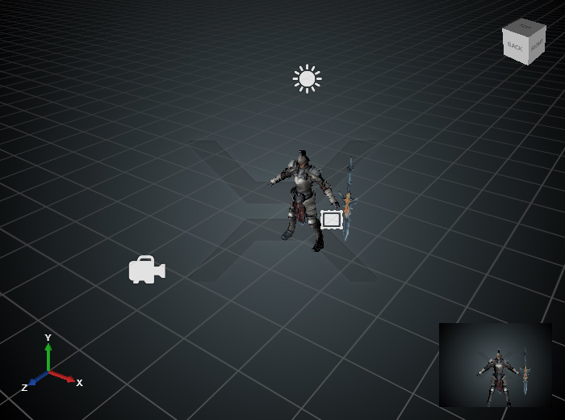

# Scene creation

In this section, you’ll learn how to:

* Create a basic [scene](xref:scene) in Xenko
* Move around your scene using navigation controls, navigation gizmos
* Add [entities](xref:entity) to your scene
* Move, rotate, and resize entities in your scene

A scene is a blank canvas, on which you can add entities. Entities refer to the objects that you added to your scene. 

Xenko provides an easy way to create scenes for your game. You can add existing assets, create assets from the existing Xenko templates, or you can import assets from external [packages](xref:package) or games. In the scene, you can move around, rotate, and resize your assets very easily and intuitively.

When you create a new project, the Scene Editor displays your scene with the default elements, such as light, camera, skybox, and an entity. By default, you’ll see the Sphere entity in the scene. You can start adding the required entities for your game.

The following image displays a sample scene with a single Knight and default elements, such as light, background, and other default entities.

   

   _Basic scene in Xenko_

To start adding content to your scene, see [Positioning entities](positioning-entities.md)
