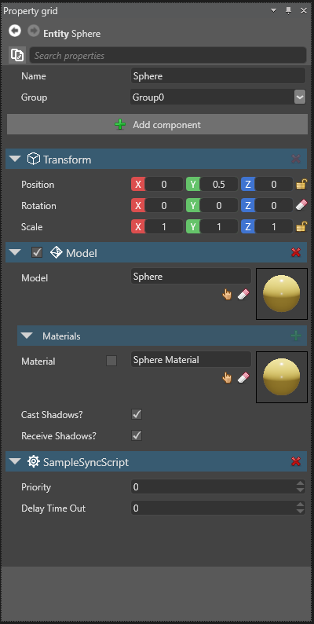

# Scripting in Xenko

In this page, you’ll learn how to use a [script](xref:scripting) in your game, types of scripts used in Xenko, and how to make the properties of your script appear in the Game Studio.

## Scripting and entities

A script is a unit of code that helps to move entities, control their movement, arrange events in your game, and respond to user inputs. All scripting in Xenko is done in C#, therefore you can use the C# programming reference, to find out about language specific information you might need.

A script can be attached to one or more entities. Multiple scripts can also be attached to a single entity. If you attach a script to multiple entities, multiple instances of that script are created. This allows for the same script to have different values for its public properties. You'll learn more about this subject later in this chapter.

## Public Engine objects

Scripts can access various Engine objects of the Xenko framework. Below a list of all available objects.

```
	public AudioSystem Audio { get; }
	public ContentManager Content { get; }
	public EffectSystem EffectSystem { get; }
	public IGame Game { get; }
	public GraphicsDevice GraphicsDevice { get; }
	public InputManager Input { get; }
	public SceneSystem SceneSystem { get; }
	public ScriptSystem Script { get; }
	public IServiceRegistry Services { get; }
	public SpriteAnimationSystem SpriteAnimation { get; }
	protected Logger Log { get; }
```

These objects are described in more detail in the API reference.

## Types of scripts

Scripts can be classified into Startup scripts, Synchronous scripts, and Asynchronous scripts.

The following are the types of scripts with examples:

* **Startup script:** This script is used to initialize an entity in a game and is executed to perform loading or unloading of the entity in the game.

```
public class StartUpScriptExample : StartupScript
{
	public override void Start()
	{
		var sphere = SceneSystem.SceneInstance.Where(x => x.Name.Equals("Sphere")).FirstOrDefault();
		sphere.Add(new BasicAsyncScript());
	}
}
```

* **Synchronous script:** This script loads sequentially and is executed sequentially. If a script in a sequence is not executed, all the subsequent scripts get terminated.

```
public class SampleSyncScript : SyncScript
{        
	public override void Update()
	{
		if (Game.IsRunning)
		{
			// Do some stuff every frame
		}
	}
}
```

* **Asynchronous script:** This script is not dependent on the execution of any other script. It can be executed randomly or with a combination of scripts without any dependency.

```
public class SampleAsyncScript : AsyncScript
{        
	public override async Task Execute() 
	{
		while (Game.IsRunning)
		{
			// Do some stuff every frame
			await Script.NextFrame();
		}
	}
}
```

## Using public properties

Public properties are values, used by the script, that can be set from the Game Studio. This functionality allows to configure scripts with dynamic parameters from the Game studio.

>**Note:** To ignore a public property in Xenko, add the ```[DataMemberIgnore]``` attribute to the property.

The following is an example of a public property:

```
public class SampleSyncScript : SyncScript
{
	// Declared public member variables and properties will be shown in Game Studio
	public float DelayTimeOut { get; set; }
	
	public override void Update()
	{
		// Do some stuff every frame
	}
}
```

In the above example, the ```SampleSyncScript``` class exposes a public property called ```DelayTimeOut```.

To have the same public property hidden from Game Studio, use the ```[DataMemberIgnore]``` attribute:

```
public class SampleSyncScript : SyncScript
{
	// This public property will not be available in Game Studio
	[DataMemberIgnore]
	public float DelayTimeOut { get; set; }
	
	public override void Update()
	{
		// Do some stuff every frame
	}
}
```

### Steps to set a public property in Game Studio

In order to set a value in the public property in the ```SampleSyncScript```. You have to assign it to an entity first.

1. Open your game in Game Studio and select the entity you want to attach the script to.

2. In the **Property grid** section, click **Add Component**, and then select the script containing the public property. In our case the script is called **SampleSyncScript**.

   

   _Select script in Property grid section_

3. The public property is displayed under the header 'SampleSyncScript' and can be set in the Property grid.
   Select the public property and change the value in ```DelayTimeOut```.

   

   _Change value of public property in Property grid section_

   
  Now that you've learned about the basics of scripting in Xenko, let's continue to [Create a script](create-a-script.md)