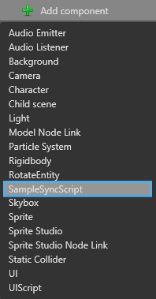

# Scripting in Xenko

In this page, you’ll learn how to use a [script](xref:scripting) in your game, types of scripts used in Xenko, and how to make the fields of your script appear in the Game Studio.

In Xenko, you can create simple or complex games. It is the script that helps to arrange the events of the game in an order, respond to an input from a player, create effects to the graphics, control the movements and behavior of your [entities](xref:entity), and other actions.

## Basics of scripting

A script is a small unit of code, which can be attached to an entity of a game. Scripts can be written for executing simple functionalities such as moving an object or for complex ones such as getting inputs from users and then recomputing the results for the objects on the screen. Without a script, your game is a static image.

A script can be attached to one or more than one entity, or one or more scripts to a single entity. If you attach a script to multiple entities, multiple instances of that script are created. The multiple instances can be run with the help of priority values set. The priority values for scripts can be set in the **Priority grid** section of Game Studio.

Now, you’ve created a script and attached it to an entity. Add that entity to the active scene, and press the **Play** button on the toolbar or press **F5** to execute your script.

## Scripts and services

Scripts can access various services in Xenko. If you need to animate a graph using a script, the script must use an engine service called Graphic Device, which contains all the graphical effects.

## Types of scripts

Scripts can be classified into Startup scripts, [Synchronous](xref:synchronous) scripts, and [Asynchronous](xref:asynchronous) scripts.

The following are the types of scripts with examples:

* **Startup script:** This script is used to initialize an entity in a game and is executed to perform loading or unloading of the entity in the game.

```
   public class StartUpScriptExample : StartupScript
	{
		public override void Start()
		{
			var sphere = SceneSystem.SceneInstance.Where(x => 	x.Name.Equals("Sphere")).FirstOrDefault();
			sphere.Add(new BasicAsyncScript());
		}
	}
```

* **Synchronous script:** This script loads sequentially and is executed sequentially. If a script in a sequence is not executed, all the subsequent scripts get terminated.

```
public class SampleSyncScript : SyncScript
    {        
        public override void Update()
        {
            //do stuff every new frame
            if (Game.IsRunning)
            {
                if (Input.IsKeyDown(SiliconStudio.Xenko.Input.Keys.Left))
                {
                    this.Entity.Transform.Position.X -= 0.1f;
                }
                if (Input.IsKeyDown(SiliconStudio.Xenko.Input.Keys.Right))
                {
                    this.Entity.Transform.Position.X += 0.1f;
                }
            }
        }
	}
```

* **Asynchronous script:** This script is not dependent on the execution of any other script. It can be executed randomly or with a combination of scripts without any dependency.

```
public class SampleAsyncScript : AsyncScript
    {        
        public override async Task Execute() 
        {
            //do stuff every new frame
            while (Game.IsRunning)
            {
                if (Input.IsKeyDown(SiliconStudio.Xenko.Input.Keys.Left))
                {
                    this.Entity.Transform.Position.X -= 0.1f;
                }
                if (Input.IsKeyDown(SiliconStudio.Xenko.Input.Keys.Right))
                {
                    this.Entity.Transform.Position.X += 0.1f;
                }
				await Script.NextFrame();
            }
        }
    }
```

## Expose fields of scripts to GS users

The public fields are fields, which are accessed by the classes or methods in your script and any other classes that reference it.

>**Note:** To ignore a public field in Xenko, add the ```[DataMemberIgnore]``` attribute to the property/field.

The following is an example of a public field:

```
public class SampleSyncScript : SyncScript
	{
		//declared public member variables and properties will show in the game studio		
		public float currentPosition { get; set; }
		
		public override void Update()
		{
			// do your stuff
			…
		}
	}
```

In the above example, a public field is added to the ```SampleSyncScript``` class and the script is attached to an entity in a game.

### Steps to set public field in Game Studio

After creating a public field, you can set the property of the public fields in the **Property grid** section.

**To set the property of public fields:**

1. Open your game in Game Studio and select the entity.
2. In the **Property grid** section, click **Add Component**, and then select the public field created.

   

   _Select script in Property grid section_

   The public field is added to the entity.
3. Select the public field and change the value in **current Position**.

   

   _Change value of public field in Property grid section_

   The value of the public field is set with the required properties.