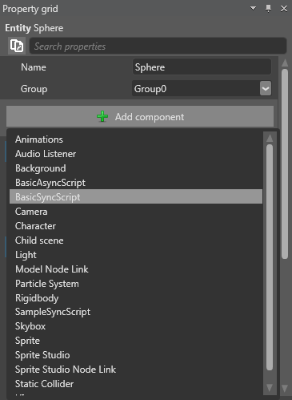

# Use a script

In this page, you’ll learn how to attach a script to an entity, how to test a script, and how to debug a script.

A [script](xref:scripting) 	is a piece of code that is used to perform different actions such as, [entity](xref:entity) movement, user input handling, and other actions. After creating a script, the next step is to use that in your game.

Game Studio enables you to easily attach, test, and debug the script that you’ve created.

## Attach a script

You can attach a script to your entity either from the **Add [component](xref:component)** section of [Game Studio](xref:game-studio) or through code.

**To attach a script from the Add component section of Game Studio:**

1. Create and build a script in Visual Studio.
2. Open your project in Game Studio.
3. Open your [scene](xref:scene), and then click the entity to which you want to attach a script.
4. In the **Property grid** section, click **Add component**.

   All components are displayed.

5. Click a script to attach to the entity.

   

   _Attach script in Property grid section_

**To attach a script through code:**

You can write a code in Game Studio to attach a script to an entity.

1. In Visual studio, create a script that includes the script name which you want to attach to the entity.
2. Click **Save**.

In the following sample **BasicAsyncScript** (Script name) is attached to **Sphere** (entity name).

```Code: 
var sphere = SceneSystem.SceneInstance.Where(x => x.Name.Equals("Sphere")).FirstOrDefault();

sphere.Add(new BasicAsyncScript());
```

## Test a script

You can test your script by running the game. Your script gets executed automatically when the entity to which you attached your script is loaded in the active scene.

**To test a script:**

1. Open your game in Game Studio.
2. Click to run your game.

You can see that your entity works as per the script.

## Debug a script

You need to debug your script if the script is not running properly or you are getting unexpected results.

**To debug a script:**

1. Open Visual Studio, and then open the script.
2. Press **F9** to add break points at the required places.
3. In Visual Studio, press **F5** or click the **Start** button to run the game in debug mode.

   Your game starts in a new window. In Visual Studio, on the script page, the first break-point highlights and stops the execution.
4. Verify the code.
5. Press **F10** (step over) if you want to execute the code line-by-line or press **F5** to continue code execution.

Now, you know how to attach, test, and debug a script. You can try to launch your game. For information on how to launch your game, see [Launch your game](launch-your-game.md). 