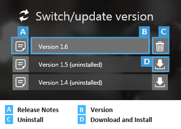

# Xenko launcher

After you install Xenko, the first window that opens on your system is the [Xenko launcher](xref:xenko-launcher). The launcher lets you manage te different versions that have been installed on your system.

This page will show you the basics of **Xenko launcher**.

The following image displays the **Xenko launcher**.

   

   *Xenko launcher*
	
## Install and start your first Game Studio version

The launcher prompts you initially to install latest version as well as the Visual Studio plugin. Using this plugin, you can edit your [shaders](xref:shaders) directly from Visual Studio. This plugin provides the features of syntax highlighting, live-code-analysis with validation, error-checking, and navigation (jump to definition). It is not mandatory to install this plugin. However, we recommend you to install it.

You can start the currently displayed version of Game Studio by clicking the Start button. To change the starting version, click a version in the **Switch/update** version section to make the selected version as your current version.
 
 
 
 _Start button of Xenko launcher_

## Manage Xenko versions

You can switch to another version of Xenko or update your current version of Xenko from the **Switch/update version** section. The launcher also allows you to choose which Xenko version(s) you want to have installed on your machine. Versions might not be compatible with each other, and therefore the version of Xenko for which the project was developed for, should be installed. This allows for projects that have been developed with different versions to keep working, without the need to upgrade them to a newer version.

>**Note:** It is possible to upgrade projects that have been developed for older versions of Xenko, however manual changes might be needed to get the project working for a newer version. **Be sure to make a backup of your project and all related files before upgrading.**

Xenko version numbers consists of 3 numbers, separated by dots: Major.Minor.Build. Versions that contain _only_ bug fixes, only have a different Build number (The Major.Minor part is the same). We highly recommend you update your version to the version with the latest Build number might one be available. 
  

 
_Various versions of Xenko_
 
>**Note:** The bug fix version updates cannot be reverted.

After the Xenko installation is completed for all the available versions, click the required version. You can see the selected version on the Start button. Click the Start button. The respective version of Game Studio is launched.

In the **Switch/update version** section, you can:

 * Click the Release Notes button to view the release notes of a Xenko version.
 * Click the Download and Install button to install a Xenko version.
 * Click the Uninstall button to uninstall a Xenko version.

For more information about the various sections of the launcher, see [Work with Xenko launcher](/manual/xenko-launcher/working-with-xenko-launcher.md).

Now, you’re ready to create your first project in Game Studio. For information on how to create a project, see [Create a project](create-project.md).
