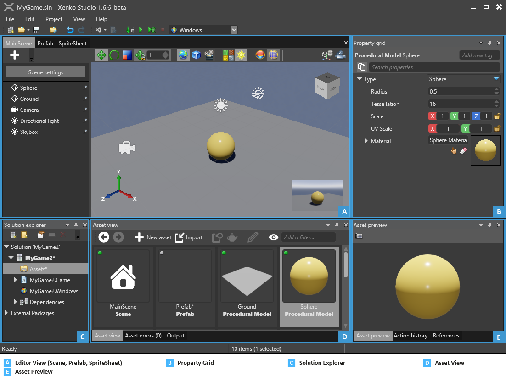

# Game Studio

The Game Studio is the central tool for game production. Its main purpose is to create and manage content for your game, but it also allows you to configure, preview and launch your game.

In this page you’ll get introduced to the different views and tabs of Game Studio. 

The following image displays Game Studio interface with a sample project. 

_Game Studio_

In the following sections, each section and tab of Game Studio is explained briefly. For more information about each section and tab in the studio, see [Work with Game Studio](work-with-xenko-studio.md).

## Asset Editors 

The Editor is the center part of the Game Studio. It is dedicated to asset editors. Asset editors are UI tools that enable you to efficiently edit specific type of assets. In the above image, you can see the Scene Editor. It is used to create the scenes of your games. For more information on scene editor, see [Scene Editor](xref:scene-editor). 

## Property grid

The **Property grid** section displays the properties of the selected [asset](xref:asset) or property. From this tab, you can modify all the properties of your game elements. You can see this tab at the right-top of the studio.

## Solution explorer

The **Solution explorer** tab displays the hierarchy of all the elements of your game. It helps you browse your assets, code files, [packages](xref:package) and dependencies. You can also modify the hierarchy by creating folders, renaming or deleting objects, and other functions.

## Asset view

You can see this tab at the bottom-center of the Studio. This tab displays all the assets of your game; you can change the view to thumbnail view or more compact grid view. You can also create and import new assets from New Asset button, also you can drag and drop assets from Asset view to the Scene Editor. 

### Asset preview

This tab displays an asset preview based on the lighting, camera, and other parameters of your scene. You can playback animations and sounds in the preview. The preview depends on the type of the asset you selected. You can see this tab at the right-bottom of the Studio.

For more information about each section and tab in the studio, see [Work with Game Studio](work-with-xenko-studio.md).

Now you’re familiar with Game Studio interface, you can start organizing your project. To know more about organizing your project, see [Project organization](project-organization.md).
