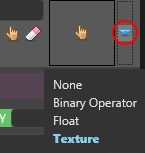
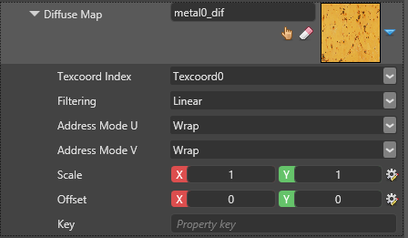
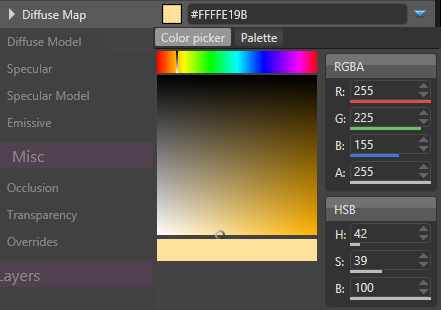

# Material Colors

Material can fetch their values using color (rgb) or scalar (single float) value providers. 

The Material System supports several kinds of color/scalar providers:

- **Texture**: The color/scalar is provided by sampling a texture
- **Constant Value**: The color/scalar is provided by a constant value
- **Binary Operator**: Combines two color/scalar value providers
- **Shader**: The color/scalar is provided by a ComputeColor shader (this is not yet accessible from the Game Studio). This provider allows to use procedural values.
- **Vertex Attribute Value** (*coming soon*): The color/sccalar is provided by attributes stored in the mesh

You can select the provider by clicking on the blue drop-down of a Diffuse Map/Specular Map/Normal Map...etc.:

 

# Texture

Sample the color/scalar from a given texture.

 

| Property           | Description                                                                                                                                                                   |
| ------------------ | ----------------------------------------------------------------------------------------------------------------------------------------------------------------------------- |
| Texture            | A reference to a texture                                                                                                                                                      |
| Channel            | Selects the channel (R, G, B, A) that will be used to extract the scalar value (Only valid for scalar texture)                                                                |
| Texcoord Index     | The texture coordinates (u,v) to use from the mesh with this texture                                                                                                          |
| Filtering          | The sampling method: Linear, Point, Anisotropic...etc.                                                                                                                        |
| Address Mode U / V | Defines how (u,v) coordinates are addressed                                                                                                                                   |
|                    |                                                                                                                                                                               |
|                    | - **Wrap**: Tiles (u,v) at integer junctions. For example: u is ranging from 0.0 to 3.0, the texture will repeat 3 times on u axis                                            |
|                    | - **Mirror**: Flips (u,v) at integer junctions. For example: for u ranging from 0.0 to 1.0, the texture is displayed as expected but from 1.0 to 2.0, the texture is mirrored |
|                    | - **Clamp**: Clamps (u,v) to the range (0.0, 1.0)                                                                                                                             |
|                    |                                                                                                                                                                               |
|                    |                                                                                                                                                                               |
| Scale              | A scale applied to (u,v)                                                                                                                                                      |
| Offset             | An offset applied to (u,v)                                                                                                                                                    |

# Constant Value

The color is provided directly as a constant value over the whole material. In case of a scalar value, a simple slider is provided instead of a color picker.

 

| Property     | Description             |
| ------------ | ----------------------- |
| Color/Scalar | A RGBA or scalar value. |

# Binary Operator

Perform a binary operation from 2 color/scalar value providers.

`Result = LeftColor  <operator> RightColor`

 

| Property | Description                                      |
| -------- | ------------------------------------------------ |
| Operator | A binary operator (Add, Multiply...etc.)         |
| Left     | The left color/scalar involved in the operation  |
| Right    | The right color/scalar involved in the operation |

# Advanced Providers

You can also use:

- A compute color shader as a color provider. It is currently accessible only from code but it will be possible to use it from the Game Studio in a future release.
- A vertex attribute color provider (coming soon)

