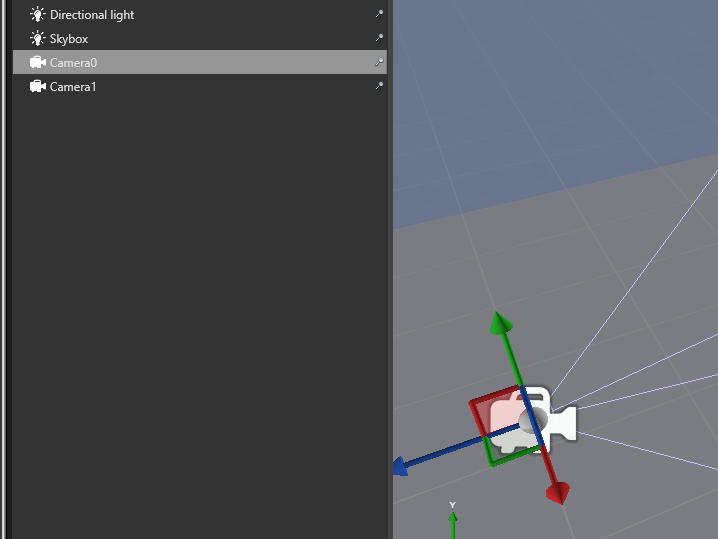
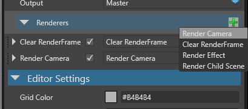
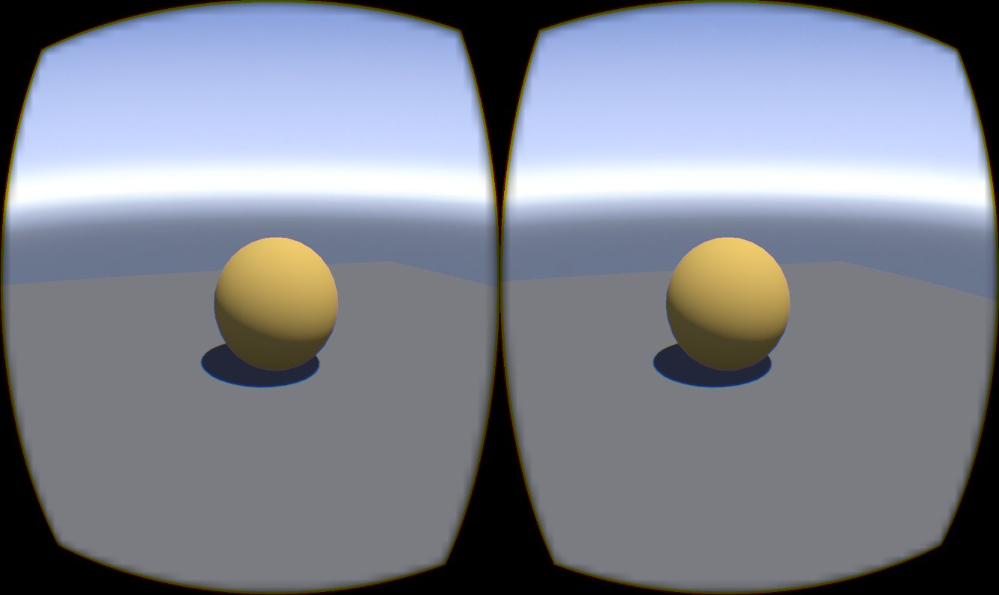

# Oculus Rift Beta Support

Xenko’s Oculus Rift support is still in very early stages but we are already exposing some interfaces to render to the Oculus Rift devices.

The following is a description of how you would proceed to create a basic game supporting Oculus Rift VR.

Create a New Game with LDR support (HDR could be used but the provided script is only supporting basic graphics composition)


Add 2 cameras to the scene, and position them to exactly the same position (later in your own scripts you might have to move them together, or else you may get dizzy)

**Make sure you remove the FpsCamera Script from the first pre-made camera!**



Edit the composition, press Scene Settings


Add both cameras to the Composition


Add a new Render Camera under Renderers



Set the first Render Camera viewport and camera slot


Set the second Render Camera viewport and camera slot


You are done for now in the Game Studio.

Next, open the project in Visual Studio and add a new source code file in the Game project using the following code:

**Note: you must manually add reference to SharpDX and SharpDX.Direct3D11 in the Game project. You can find those assemblies in the Xenko SDK folder (Under the folder where you installed Xenko, by default for example: C:\Program Files\Silicon Studio\Xenko\GamePackages\Xenko.1.6.6-beta\Bin\Windows-Direct3D11\).**
```
using System;
using System.Threading.Tasks;
using SiliconStudio.Xenko.Engine;
using SiliconStudio.Xenko.Rendering;
using SharpDX.Direct3D11;
using SiliconStudio.Core.Mathematics;
using SiliconStudio.Xenko.Graphics;
using SiliconStudio.Xenko.Graphics.Direct3D;
using SiliconStudio.Xenko.Native;
using SiliconStudio.Xenko.Rendering.Composers;

namespace OculusRenderer
{
    public class OculusGame : Game
    {
        private Texture[] textures;
        private int texturesCount;
        private Texture depthBuffer;

        public IntPtr SessionPtr { get; }

        public Texture2D MirrorTexture { get; private set; }

        public DirectRenderFrameProvider[] FrameProviders { get; private set; }

        public SceneCameraRenderer[] SceneCameraRenderers { get; } = new SceneCameraRenderer[2];

        public ClearRenderFrameRenderer ClearRenderFrameRenderer { get; private set; }

        public CameraComponent CameraLeft { get; private set; }

        public CameraComponent CameraRight { get; private set; }

        public DeviceContext NativeDeviceContext { get; private set; }

        public OculusGame()
        {
            //load oculus SDK and find the HMD device
            if (!OculusOvr.Startup())
            {
                throw new Exception(OculusOvr.GetError());
            }

            //create a directx session
            long luid;
            SessionPtr = OculusOvr.CreateSessionDx(out luid);
            if (SessionPtr == IntPtr.Zero)
            {
                throw new Exception(OculusOvr.GetError());
            }

            //we need to tell to the device manager to select the oculus as adapter
            GraphicsDeviceManager.RequiredAdapterUid = luid.ToString();
        }

        protected override Task LoadContent()
        {
            //Create directx11 render target textures
            var nativeDevice = SharpDxInterop.GetNativeDevice(GraphicsDevice);
            if (!OculusOvr.CreateTexturesDx(SessionPtr, nativeDevice.NativePointer, out texturesCount, GraphicsDevice.Presenter.BackBuffer.Width, GraphicsDevice.Presenter.BackBuffer.Height))
            {
                throw new Exception(OculusOvr.GetError());
            }

            //create the frame providers to use in the graphics composition
            textures = new Texture[texturesCount];
            FrameProviders = new DirectRenderFrameProvider[texturesCount];
            for (var i = 0; i < texturesCount; i++)
            {
                var ptr = OculusOvr.GetTextureDx(SessionPtr, new Guid("6f15aaf2-d208-4e89-9ab4-489535d34f9c"), i);
                if (ptr == IntPtr.Zero)
                {
                    throw new Exception(OculusOvr.GetError());
                }
                var dxTex = new Texture2D(ptr);
                textures[i] = SharpDxInterop.CreateTextureFromNative(GraphicsDevice, dxTex, true);

                if (depthBuffer == null)
                {
                    depthBuffer = Texture.New2D(GraphicsDevice, textures[0].Width, textures[0].Height, PixelFormat.D24_UNorm_S8_UInt, TextureFlags.DepthStencil);
                }

                FrameProviders[i] = new DirectRenderFrameProvider(RenderFrame.FromTexture(textures[i], depthBuffer));
            }

            //get the debug mirror texture to render in the backbuffer
            var mirrorPtr = OculusOvr.GetMirrorTexture(SessionPtr, new Guid("6f15aaf2-d208-4e89-9ab4-489535d34f9c"));
            MirrorTexture = new Texture2D(mirrorPtr);

            return Task.FromResult(0);
        }

        protected override void BeginRun()
        {
            //setup again the composition, adding oculus pre and post renderers 
            var compositor = (SceneGraphicsCompositorLayers)SceneSystem.SceneInstance.Scene.Settings.GraphicsCompositor;

            ClearRenderFrameRenderer = (ClearRenderFrameRenderer)compositor.Master.Renderers[0];
            SceneCameraRenderers[0] = (SceneCameraRenderer)compositor.Master.Renderers[1];
            SceneCameraRenderers[1] = (SceneCameraRenderer)compositor.Master.Renderers[2];

            var backbufferNative = SharpDxInterop.GetNativeResource(GraphicsDevice.Presenter.BackBuffer);

            //rebuild the renderers structure
            compositor.Master.Renderers.Clear();
            compositor.Master.Renderers.Add(new OculusPreRenderer(this));
            compositor.Master.Renderers.Add(ClearRenderFrameRenderer);
            compositor.Master.Renderers.Add(SceneCameraRenderers[0]);
            compositor.Master.Renderers.Add(SceneCameraRenderers[1]);
            compositor.Master.Renderers.Add(new SceneDelegateRenderer((x, y) => //post action, commit to oculus and copy mirror texture to backbuffer
            {
                OculusOvr.CommitFrame(SessionPtr);

                var nativeContext = SharpDxInterop.GetNativeDeviceContext(x.CommandList);
                nativeContext.CopyResource(MirrorTexture, backbufferNative);
            }));

            //setup camera parameters
            CameraLeft = compositor.Cameras.GetCamera(0);
            CameraLeft.UseCustomProjectionMatrix = true;
            CameraLeft.UseCustomViewMatrix = true;
            CameraRight = compositor.Cameras.GetCamera(1);
            CameraRight.UseCustomProjectionMatrix = true;
            CameraRight.UseCustomViewMatrix = true;

            base.BeginRun();
        }

        protected override void Destroy()
        {
            //cleanup
            if (SessionPtr != IntPtr.Zero) OculusOvr.DestroySession(SessionPtr);
            OculusOvr.Shutdown();
        }
    }

    public class OculusPreRenderer : SceneDelegateRenderer
    {
        private readonly OculusGame game;

        public OculusPreRenderer(OculusGame game) : base((a, b) => { })
        {
            this.game = game;   
        }

        public override void Collect(RenderContext context)
        {
            PrepareEyes();

            base.Collect(context);
        }

        internal unsafe void PrepareEyes()
        {
            //override and setup camera parameters, using data from the rift sensors and such
            Matrix leftProj, rightProj;
            Vector3 posLeft, posRight;
            Quaternion rotLeft, rotRight;
            OculusOvr.PrepareRender(game.SessionPtr, game.CameraLeft.NearClipPlane, game.CameraLeft.FarClipPlane,
                (float*)&leftProj, (float*)&rightProj, (float*)&posLeft, (float*)&posRight, (float*)&rotLeft, (float*)&rotRight);

            game.CameraLeft.ProjectionMatrix = leftProj;
            var posL = game.CameraLeft.Entity.Transform.Position + Vector3.Transform(posLeft, game.CameraLeft.Entity.Transform.Rotation);
            var rotL = Matrix.RotationQuaternion(game.CameraLeft.Entity.Transform.Rotation) * Matrix.RotationQuaternion(rotLeft);
            var finalUpL = Vector3.TransformCoordinate(new Vector3(0.0f, 1.0f, 0.0f), rotL);
            var finalForwardL = Vector3.TransformCoordinate(new Vector3(0, 0, -1), rotL);
            var viewL = Matrix.LookAtRH(posL, posL + finalForwardL, finalUpL);
            game.CameraLeft.ViewMatrix = viewL;

            game.CameraRight.ProjectionMatrix = rightProj;
            var posR = game.CameraRight.Entity.Transform.Position + Vector3.Transform(posRight, game.CameraRight.Entity.Transform.Rotation);
            var rotR = Matrix.RotationQuaternion(game.CameraRight.Entity.Transform.Rotation) * Matrix.RotationQuaternion(rotRight);
            var finalUpR = Vector3.TransformCoordinate(new Vector3(0.0f, 1.0f, 0.0f), rotR);
            var finalForwardR = Vector3.TransformCoordinate(new Vector3(0, 0, -1), rotR);
            var viewR = Matrix.LookAtRH(posR, posR + finalForwardR, finalUpR);
            game.CameraRight.ViewMatrix = viewR;

            //find which target is the current target for the frame and set them as target
            var index = OculusOvr.GetCurrentTargetIndex(game.SessionPtr);

            game.ClearRenderFrameRenderer.Output = game.FrameProviders[index];
            game.SceneCameraRenderers[0].Output = game.FrameProviders[index];
            game.SceneCameraRenderers[1].Output = game.FrameProviders[index];
        }
    }
}

```

Then, you must replace your Windows Game script with the following script (in the MyOculusGame.Windows project).
```
using OculusRenderer;

namespace MyOculusGame
{
    class MyOculusGameApp
    {
        static void Main(string[] args)
        {
            using (var game = new OculusGame())
            {
                game.Run();
            }
        }
    }
}
```

We’re almost done. At this point, build the whole solution but do not run it yet. This will populate the output folders with the correct files. We need to add 2 extra dlls for Oculus SDK support before running. 

Download them [here](media/libOVR.zip)

Drop the content of the zip file in the output folder


Good to go, try running your game! Enjoy!




