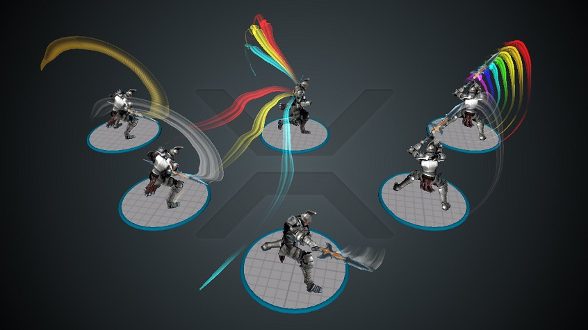
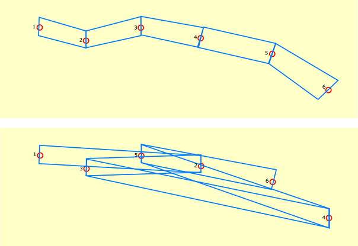
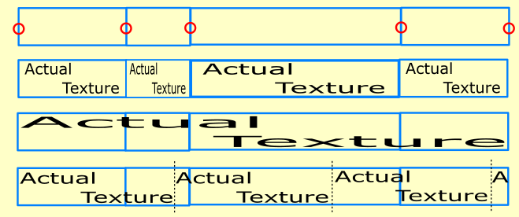
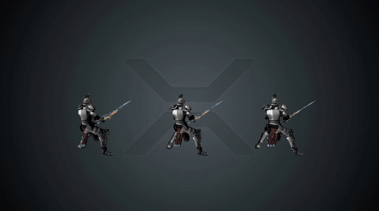

# Ribbons and Trails

This tutorial explains in depth how to create ribbons and trails using particles.

## Sample

You can check the **Ribbon Particles Sample** if you need a quick look at a project which already uses ribbons and trails.

## Step-by-step

Ribbons and trails are particle shape builders which build the mesh data as a strip connecting all particles, rather than individual quads.

In the picture above we have the same particle data (shown as red dots), but in the first case we render them as individual quads (shown as blue rectangles). In the second case we choose to render them as a strip, connecting each particle to the next one and rendering the quad between two adjacent particles, rather than on top of each one. For the user it will appear as one continuous strip or *ribbon*.

To change the shape go to *Shape* and choose either *Ribbon* or *Trail*. They are both displayed as connected strips of quads, but the ribbon will try to render the strip facing the camera as much as possible. The trail on the other hand will display the strip fixed in 3D space, but it requires one additional attribute, Direction. With both the particle's position and direction a completely defined 3D surface can be built.

### Order Matters

If you switched from a billboard shape to a ribbon or a trails you may experience the following problem.

Rather than connecting the particles in order, the strip will erratically jump between seemingly random particles. This is the same problem alpha-blended quads have when they are not properly sorted and pop out in the wrong order.

To enable sorting suitable for ribbon particles, change the *Sorting* property of the emitter. If it's None the particles will not be sorted in any way and will appear random. Sorting them by depth might work in some very niche cases, but it doesn't preserve order between different frames and it's generally a good idea to avoid it.

Most commonly you want to sort the particles by age or by spawn order (the order in which they were first emitted).

If all your particles have the same *Lifespan* and you emit no more than one particle each frame (at 30 or less particles per second that's usually the case), you can sort them by age. 

However if you spawn several particles per second or particles can have varied *Lifespan*, sorting them by age doesn't provide a consistent order, as the sorting parameter will change between frames.

In such cases you want to sort the particles by order. Order is an new particle attribute, but it's not included by default. Adding a new Initializer, *Spawn Order*, add the required attribute to the particle system and the particles can now be sorted by order.

### Ribbons vs Trails

So far we have mentioned two terms, *ribbons* and *trails*. Both of them generate a flat strip surface which follows an axis, connecting all adjacent particles in a line. This line defines one of the axes of the surface, which is the same for both ribbons and trails.

The difference lies in the second axis used to build the shape. In case of ribbons, the second axis will be positioned in camera space, trying to face the ribbon towards the camera at all times. This gives the illusion of volume to the ribbon, but the shape is not stable in 3D, as it changes when the camera moves.

The trail on the other hand is a surface firmly fixed in 3D space. It does so by reading an extra attribute, *Direction*, from the particle data and using it as a second axis for the surface. This attribute is fixed in 3D and doesn't change with the camera position.

The image below shows the different behavior for ribbons (red) and trails (yellow) when viewed from different camera angles.

### Texture Coordinates

Both ribbons and trails have texture coordinates options (or *UV coordinates*) used to define how the textures will be mapped across the surface. Unlike billboards, which are individual quads, ribbons and trails share the same surface between all particles so that's why the uv coordinates options are defined in the shape builder.

UV Coords define if the coordinates should be assigned as quads for each segment (AsIs), stretched between the first and the last particle in the ribbon (Stretched), or use actual world distance between particles to calculate how the V-coordinate should be mapped (DistanceBased). The image below shows the difference between the three methods.

 - AsIs - the texture will be mapped per segment, essentially copying the same quad stretched between every two particles. This can be useful if combined with flipbook animations (found in the Material settings).
 
 - Stretched - the texture will be stretched between the first and the last particle of the ribbon. The attribute *UV Factor* defines how many times the texture will appear across the entire ribbon, with 1 indicating only once.

 - DistanceBased - the texture will be repeated every so often, based on the actual world length of the ribbon rather than number of particles. The attribute *UV Factor* defines the distance after which the pattern will repeat, with 1 indicating a repeat step of 1 meter.

### Smoothing

Ribbons and trails will often have to be built around limited number of control points (particles) when the spawn rate is slow or the origin's movement is rapid. In such cases it is useful to add extra segments between adjacent particles and smooth the control line defining the ribbon.

 - None - no smoothing means there will only be one segment between each two particles, and the ribbon will appear segmented if there are sharp angles along the central axis.
 
 - Fast - fast smoothing uses Catmull-Rom interpolation to calculate extra control points between each two particles. The number of segments between every two particles can be controlled with the *Segments* property.
 
 - Best - the best smoothing tries to match a circumcircle around every three sequential particles along the control axis and then adds extra control points on the circle, keeping the segments in an arc. For the first and the last segment there is only one arc to be followed, but for mid-sections there are two different arcs from two different circles. In such cases the control points will be interpolated from the first arc to the second, as the point approaches the second particle. The number of segments between every two particles can be controlled with the *Segments* property.

The animation below shows the difference between the three interpolation methods.

