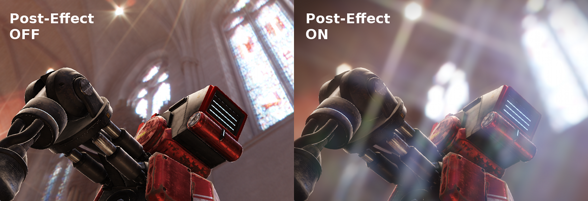

# Post-Effects

Post-effects are usually applied after your game has completed the rendering of a frame, but before the UI is drawn. 

They are used to tune, to embellish an image, for example by giving it a more "natural", "realistic" look improving over the original "artificial" one.

They can also be used purely artistically to change the mood of a scene.

 

Post-effects are usually applied on an image: this means they don't know vertices or meshes, they only work with the color values of each pixel (and sometimes their depth).

A post-effect is typically set-up by providing:

- some input buffers (color, depth...)
- one or several output buffers
- some parameters to customize the behavior of the post-effect during its rendering pass

Xenko provides an easy and powerful system to chain such effects. 

We provide a bunch of pre-defined post-effects, but you can easily extend the system, create and integrate your own effects!

