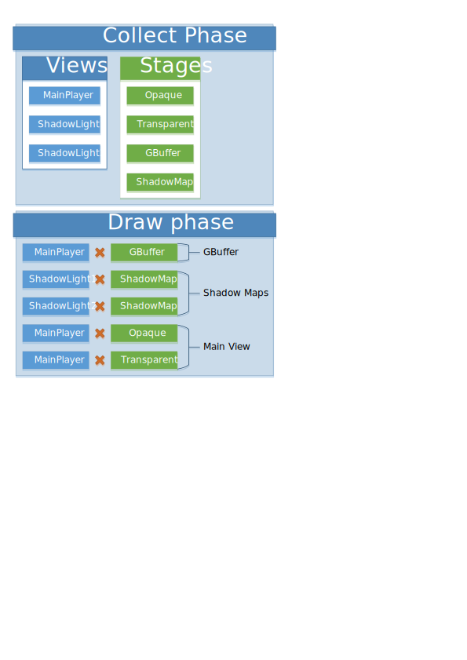

# Render features

A @'SiliconStudio.Xenko.Rendering.RenderFeature' is responsible for drawing a given type of @'SiliconStudio.Xenko.Rendering.RenderObject'.

## Render phases

### Collect

The collect phase will determine what needs to be processed and rendered.

It is usually driven by the [Graphics Compositor](../graphics-compositor/index.md).

It is responsible to:
* Create render views, and update them with most recent data such as view and projection matrices
* Create and setup render stages
* Perform visibility culling and sorting

### Extract

The extract phase will copy data from game states of previously collected objects to short-lived render-specific structures.

It is usually driven by the @'SiliconStudio.Xenko.Rendering.RenderSystem' and @'SiliconStudio.Xenko.Rendering.RenderFeature's.

This should be as fast as possible and avoid heavy computations since game update and scripts are blocked (heavy computations should be deferred to [Prepare](#prepare)).

> *NOTE*
>
> Currently, we don't parallelize game update and scripts, so they won't be resumed until Prepare and Draw are finished as well, but this will likely be improved in the future.

Examples of performed tasks:
* Copy object matrices
* Copy material parameters

### Prepare

During Prepare, we perform heavy computations and prepare GPU resources.

It is usually driven by the @'SiliconStudio.Xenko.Rendering.RenderSystem' and @'SiliconStudio.Xenko.Rendering.RenderFeature's.

Some examples:
* Compute lighting data and structures
* Fill constant buffers and resource tables

### Draw

During Draw, we fill GPU command list.

This includes:
* Setting up render targets
* Drawing combinations of render stage with render view.

### Example

Here is a typical example of views, stages created during **Collect** phase, and how we would use them during the **Draw** phase:

