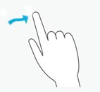
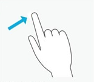
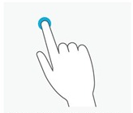
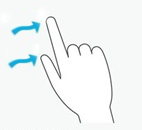
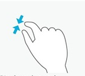

# Gestures

Gestures are special patterns made by pointers that the system is able to recognize and trigger. Gestures can be single or multiple fingers depending on their type.

# Overview

Xenko currently provides support for 5 different type of gestures: *Drag, Flick, LongPress, Composite, Tap*. Each of those gestures is configurable by the programmer via the *GestureConfig* classes (each gesture has its own associated config class).

When the system detects a gesture, a @'SiliconStudio.Xenko.Input.GestureEvent' is added to the list of gesture events of the input system. Each gesture has its own associated gesture event class. The @'SiliconStudio.Xenko.Input.GestureEvent.Type' field of the gesture event indicate which gesture has been recognized. The user can then cast the base gesture event into the gesture specific event type to have gesture type specific information about the event. The system can detect several gesture simultaneously, so the event list can contain more than one item at a given frame. Notice that this list is cleared every frames by the system, so it is the programmer responsibility to check it correctly if he wants to react on gestures.

There is mainly two types of gestures: discrete and continuous gestures. Discrete gestures (*Flick, LongPress, Tap)* trigger only one event every time they happened. On the contrary continuous gestures (*drag, Composite)* trigger a whole series of events every time that the gesture properties change so that the programmer can update the UI or its game in real time. The programmer can follow the current state of gesture (*Began, Changed, Ended, Occurred)* by checking the @'SiliconStudio.Xenko.Input.GestureEvent.State' field of gesture event. The state of an discrete gesture is always *Occurred**.* The state of a continuous gesture always starts by *Began* when the gesture is detected, then is followed by the series of *Changed* events as the gesture goes on, and finally ends by a *Ended* event when the gesture finishes.

Some gestures (*Drag* and Flick) can be restricted to specific shapes (*vertical,* *horizontal*). When it is the case the gesture event is triggered only the gesture is close enough to the indicated shape.

## Drag Gesture

 

**Type** : Continuous

**Configuration class**: @'SiliconStudio.Xenko.Input.GestureConfigDrag'

**Event class**: @'SiliconStudio.Xenko.Input.GestureEventDrag'

**Action description**:The user touched the screen, performed a translation and withdraw its finger(s).

**Comments**: The number of finger on the screen cannot vary during the gesture. The programmer can modify the @'SiliconStudio.Xenko.Input.GestureConfigDrag.MinimumDragDistance' field if he need the gesture to be triggered for smaller drags. 

## Flick Gesture 

 

**Type** : Discrete

**Configuration class**: @'SiliconStudio.Xenko.Input.GestureConfigFlick'

**Event class**: @'SiliconStudio.Xenko.Input.GestureEventFlick'

**Action description**:The user touched the screen, performed a quick straight translation and withdraw its finger(s).

**Comments**: The number of finger on the screen cannot vary during the gesture. The programmer can modify the @'SiliconStudio.Xenko.Input.GestureConfigFlick.MinimumFlickLength' field to constrain the flick to have a minimum length. 

## Long Press Gesture 

 

**Type** : Discrete

**Configuration class**: @'SiliconStudio.Xenko.Input.GestureConfigLongPress'

**Event class**: @'SiliconStudio.Xenko.Input.GestureEventLongPress'

**Action description**:The user touched the screen, and maintained the pressure without moving during a given time (default about 1 second).

**Comments**: The number of finger on the screen cannot vary during the gesture. The programmer can modify the @'SiliconStudio.Xenko.Input.GestureConfigLongPress.RequiredPressTime' field to change the press time. 

## Composite Gesture 

   

**Type** : Continuous

**Configuration class**: @'SiliconStudio.Xenko.Input.GestureConfigComposite'

**Event class**: @'SiliconStudio.Xenko.Input.GestureEventComposite'

**Action description**:The user touched the screen with two fingers, and moved them independently.

**Comments**: This gesture is a composition the 3 basic transformations *translation, scale, rotation*. It requires exactly 2 fingers on the screen. The gesture is triggered when the system detect a small translation, scale or rotation. To perform a translation, the user translates uniformly the two fingers together. To perform a scale, the user moves closer or further the two fingers from each other. To perform a rotation, the user turns the two fingers around there their middle.

## Tap Gesture 

 

 

**Type** : Discrete

**Configuration class**: @'SiliconStudio.Xenko.Input.GestureConfigTap'

**Event class**: @'SiliconStudio.Xenko.Input.GestureEventTap'

**Action description**:The user touched the screen, and removed its fingers quickly without moving.

**Comments**: The number of finger on the screen cannot vary during the gesture.The programmer can modify the @'SiliconStudio.Xenko.Input.GestureConfigTap.RequiredNumberOfTaps' field to decide the number tap that he wants to detect. Note that to be able to distinguish single taps from multi-tap taps, the system has to wait a given time and thus introduces latency in tap events. If the programmer is interested only in single taps, he can put the @'SiliconStudio.Xenko.Input.GestureConfigTap.MaximumTimeBetweenTaps' field to 0 to avoid this latency.

# Usage

By default, the input system does not recognize any Gesture. To start (resp. stop) some gesture recognition the programmer has to add (resp. remove) gesture configurations to the @'SiliconStudio.Xenko.Input.ActivatedGestures' collection. Once a gesture is activated for recognition, its associated configuration is frozen and the user cannot modify it any more. If the user wants to stop all gesture recognition he can directly clear the collection.

**Code:** Activate/Desactivate Gestures Recognitions

```cs
var singleTapConfig = new GestureConfigTap(); // create the configuration of the gesture we want to recognize
Input.ActivatedGestures.Add(singleTapConfig); // start the tap gesture recognition
 
var doubleTapConfig = new GestureConfigTap(2, 1); // create the configuration of the gesture we want to recognize
Input.ActivatedGestures.Add(doubleTapConfig ); // start the double tap gesture recognition
 
 // ...
 
Input.ActivatedGestures.Remove(singleTapConfig); // stop the tap gesture recognition
 
// ...
Input.ActivatedGestures.Clear(); // stop all remaining gesture recognitions
```


 

Each configuration class has a parameterless constructor corresponding to the default gesture configuration. Special constructors have also been implemented for parameters that the programmer may modify frequently. Other parameters correspond to fields that are not recommended to modify to keep a good coherency of the system. Those fields can be modified by accessing the corresponding properties.

**Code:** Set gesture configuration

```cs
var singleTapConfig = new GestureConfigTap(); // default config for the gesture.
var doubleTapConfig = new GestureConfigTap(2, 2); // personalize the gesture config by using the dedicated constructor
var noLatencyTap = new GestureConfigTap() { MaximumTimeBetweenTaps= TimeSpan.Zero }; // personalize the gesture config by directly accessing the desired property (user must be aware of was he does, this may break the input system coherency in some cases)
```


 

The programmer can access the recognized gestures via the @'SiliconStudio.Xenko.Input.IInputManager.GestureEvents' collections. The collection is automatically cleared every frame.

**Code:** Access Gesture events

```cs
var currentFrameGestureEvents = Input.GestureEvents;
```


 

One can use the @'SiliconStudio.Xenko.Input.GestureEvent.Type' field to identidy the gesture type and then cast it to the appropriate event type to have extra info about the event. 

**Code:** Identifying the gesture type

```cs
foreach( var gestureEvent in Input.GestureEvents)
{
   	if (gestureEvent.Type != GestureType.Tap) // determine if the event is from a tap gesture
		continue;
   
	GestureEventTap  tapEvent = (GestureEventTap) gestureEvent; // cast the event the specific tap event class
    log.Info("Tap position: {0}.", tapEvent.TapPosition); // access tap event specific field
}
```


 

One can know the gesture state by analysing the @' SiliconStudio.Xenko.Input.GestureEvent.State' field.

**Code:** Identifying the event state

```cs
switch(compositeGestureEvent.State)
{
case GestureState.Began:
	image.ComputePreview();
	break;
case GestureState.Changed:
	image.TransformPreview(compositeGestureEvent.TotalScale, compositionGestureEvent.TotalRotation);
	break;
case GestureState.Ended:
	image.TransformRealImage(compositeGestureEvent.TotalScale, compositionGestureEvent.TotalRotation);
	break;
default:
	break;
}
```


 

# Remarks

- The input system works with normalized coordinates. So all the lengths, speeds and error margins of configuration files must be expressed in this normalized coordinate system.

