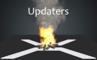
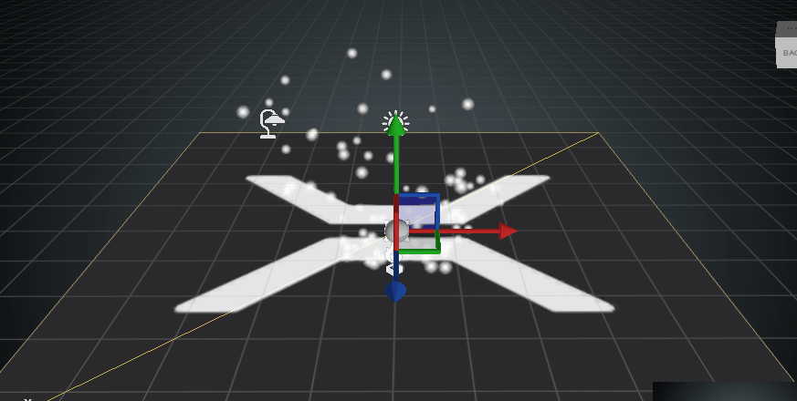
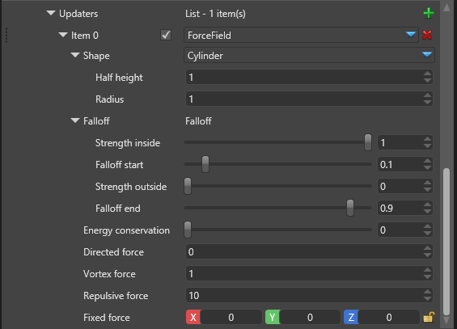
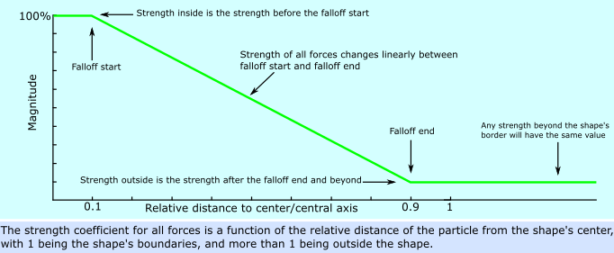

# Particle Updaters

 

Once a particle is spawned it can change over time before it disappears. Updaters act on all living particles over time, changing their attributes like position, velocity, color, etc. For example a gravity force is an updater which updates the particle's velocity with a constant value, making it accelerate faster towards the ground.

There are several built-in updaters and more will be added in the future. The [Custom Particles](../../particles-samples/particles-samples-custom/index.md) sample shows how you can add your own updaters to the engine.

## Collider

 

A collider is an updater which changes the particle's position and velocity when it collides with a predefined shape.

 

| Property              | Description                                                                                                                      |
| --------------------- | -------------------------------------------------------------------------------------------------------------------              |
| Debug draw            | If checked, the bounding shape for the force will be drawn.                                                                      |
|                       | *Note This checkbox will be removed in the future and will be replaced by the currently selected property.*                      |
| Inheritance           | The force updater can inherit none or several of the following: position, rotation, scale                                        |
| Offset                | Offset is the local location matrix for the updater, applied on top of the inherited values                                      |
| Shape                 | The shape against which the particles will collide, which can be shpere, cylinder, box or a torus.                               |
| IsSolid               | If checked, the shape is solid and the particles will bounce off it, staying outside.                                            |
|                       | Otherwise, the shape is hollow, like a container, and the particles will be restricted to the inside volume only.                |
| Kill Particles        | If checked, the particles will be killed immediately when they first collide with the shape.                                     |
| Restitution           | The coefficient of restitution is the speed the particle retains in comparison to its speed before the collision.                |
|                       | In this updater we use restitution as a *vertical only* speed. It doesn't affect the speed along the surface.                    |
| Friction              | Friction is the amount of horizontal speed the particle loses upon collision with the shape.                                     |
|                       | It only affects the speed along the surface, and doesn't change the height at which the particle will bounce.                    |
|                       |                                                                                                                                  |

## Force Field

 

The force field is defined by a bounding shape and several force vectors which operate on the particles based on their relative position to the bounding shape.

 

 

| Property              | Description                                                                                                                      |
| --------------------- | -------------------------------------------------------------------------------------------------------------------              |
| Debug draw            | If checked, the bounding shape for the force will be drawn.                                                                      |
|                       | *Note This checkbox will be removed in the future and will be replaced by the currently selected property.*                      |
| Inheritance           | The force updater can inherit none or several of the following: position, rotation, scale                                        |
| Offset                | Offset is the local location matrix for the updater, applied on top of the inherited values                                      |
| Shape                 | The bounding shape which can be shpere, cylinder, box or a torus.                                                                |
| Energy Conservation   | What part of the force energy should be conserved as particle velocity.                                                          |
|                       | Energy which is not conserved directly applies to the particle's position and is lost when the force vanishes.                   |
|                       | Energy which is conserved is stored as particle velocity and results in gradually increasing speed.                              |
| Falloff               | The falloff is a simple linear function which dictates how strong the force is based on the particle's distance from its center. |
|                       | Strength inside is how much of the magnitude should apply when the particle is within *falloff start* distance from the center.  |
|                       | Strength outside is how much of the magnitude should apply when the particle more than *falloff end* away from the center.       |
|                       | Both values are relative to the bounding shape's sizes and values in-between are interpolated between the two magnitudes.        |
|                       | Values in the center can still be 0, making the force only work *outside* the bounding shape.                                    |
|                       |                                                                                                                                  |
| Directed Force        | Vector force which moves the particle along the field's central axis (normally upwards)                                          |
|                       |                                                                                                                                  |
| Vortex Force          | Vector force which moves the particle around the field's central axis using the right-hand rule for rotation                     |
|                       |                                                                                                                                  |
| Repulsive Force       | Vector force which moves the particle away from the field's center or towards it, if negative.                                   |
|                       |                                                                                                                                  |
| Fixed Force           | Vector force which moves the particle along a fixed non-rotating and non-scaling axis.                                           |
|                       |                                                                                                                                  |

### Falloff

The default falloff has the following behavior:

 

For example, if the bounding shape is a sphere with a radius 10m, particles within 1m from its center (0.1 x 10m) will be moved with full strength. After the 1m distance the strength will linearly decrease until it reaches zero at 9m distance (0.9 x 10m). After that point the forces won't affect the particle.

### Bounding Shapes

#### Sphere

 

When the bounding shape is a shpere, the falloff distance is based on the radial distance of the particle from the sphere's center. If the sphere is scaled to an ellipsoid, this distance is also scaled. The distance is relative to the radius, with 1.0 being the sphere's surface.

The directed force vector is parallel to the sphere's local Y axis.

The repulsive force vector is pointing out from the center to the particle.

The vortex force vector goes around the sphere's Y axis at the particle's position (using the right-hand rule for rotation).

#### Box

 

When the bounding shape is a box, the falloff distance is the longest of the three distances on the X, Y and Z axes. The distance is relative to the box's sizes, with 1.0 being the box's surface.

The directed force vector is parallel to the box's local Y axis.

The repulsive force vector is pointing out from the center to the particle.

The vortex force vector goes around the box's Y axis at the particle's position (using the right-hand rule for rotation).

#### Cylinder

 

When the bounding shape is a cylinder, the falloff distance is based on the radial distance of the particle from the cylinder's local Y axis. Particle's height (position on the Y axis) is ignored unless the particle is outside the cylinder, in which case the distance is always 1.

The directed force vector is parallel to the cylinder's local Y axis.

The repulsive force vector is pointing out from the cylinder's local Y axis to the particle. As such the repulsive force is always horizontal.

The vortex force vector goes around the cylinder's Y axis at the particle's position (using the right-hand rule for rotation).

#### Torus

 

When the bounding shape is a torus, the field's nature changes completely. The falloff distance is based on the radial distance of the particle from the torus's inner circle (axis of revolution, shown in red), choosing a point on the circle closest to the particle.

The directed force vector is tangent to the axis of revolution at the point closest to the particle.

The repulsive force vector is pointing out from the axis to the particle.

The vortex force vector goes around the directed force vector using the particle's position relative to the axis (using the right-hand rule for rotation).

While the math is a little complicated, using the torus force field is not, and we encourage you to try it out for better understanding.

## Gravity

The gravity updater is a very simplified force which affects all particles regardless of their position, with a constant force vector which doesn't scale or rotate.

It's eidtable so that it can be used in games with different scales and behavior.

 

The gravity force ignores most properties like offset and inheritance, and only uses the following attributes:

| Property                   | Description                                                                         |
| -------------------------- | ----------------------------------------------------------------------------------- |
| Gravitational Acceleration | The gravity force vector which defines the acceleration for all affected particles. |
|                            | The default value matches the average gravity on Earth, but it's editable.          |
|                            |                                                                                     |

