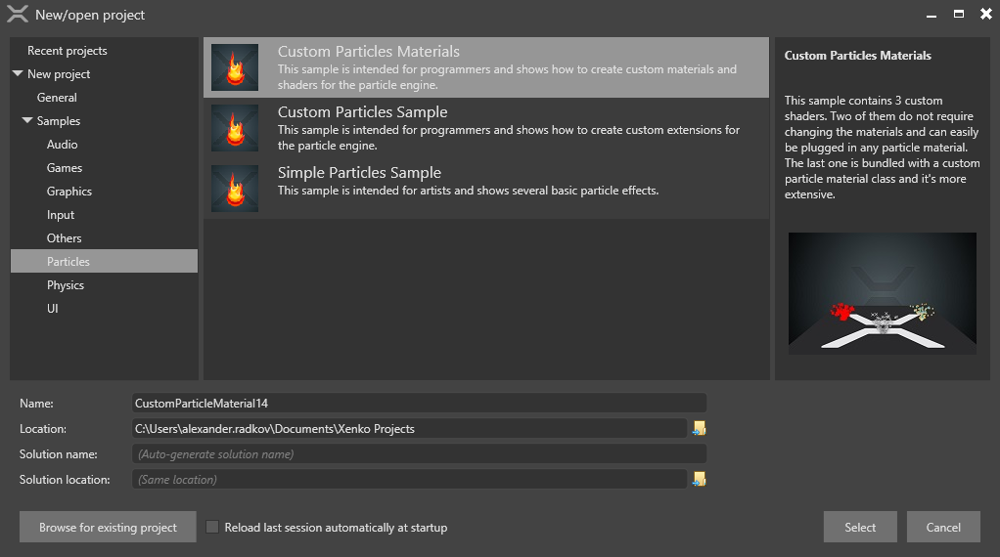
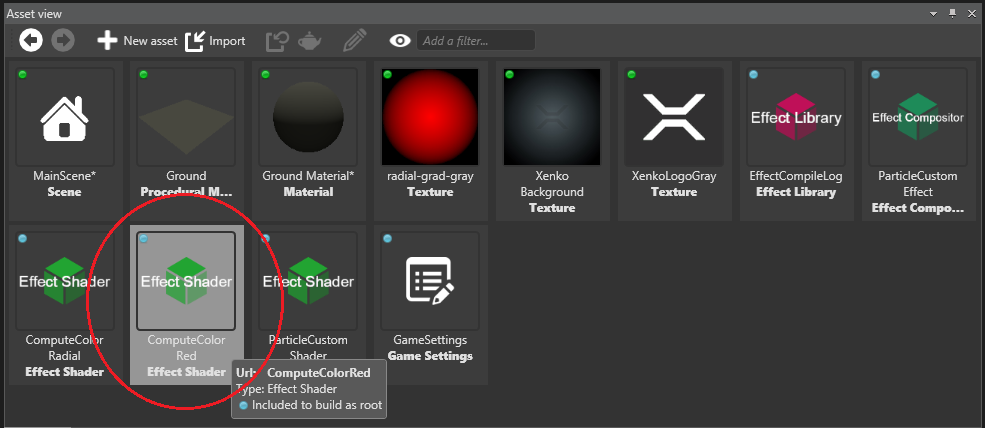
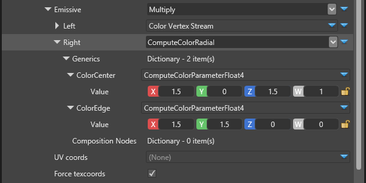

# Particle Materials Walkthrough

This walkthrough shows how you can create custom shaders and materials for a particle system, providing functionality not available in the core engine.

The sample is focused primarily on shaders and rendering. For simulation, please check the [Custom Particles](../particles-samples-custom/index.md) sample walkthrough.

Please check the [Editing Particles](../../particles-reference/particles-reference-editor/index.md) page if you are not familiar with how to edit the particles.

This walkthrough will require some scripting. Make sure you have an IDE installed (the [Community](https://www.visualstudio.com/en-us/downloads/download-visual-studio-vs.aspx) version of Visual Studio is free).


 

Start by creating a new Custom Particle Materials Sample from the New project menu. There are three entities in the scene graph named Rad Particle System, Radial Particle System and Two Textures Particle System. Select either one and navigate to its source particle system, expanding the emitter in it and its material.

## Overview

 

The three custom shaders show different degrees of customization. We will go over them in order of increasing difficulty.

### Red Particle System

The Red Particle System has a very simple customization. Since the [Material Colors](../../../graphics/graphics-reference/materials-reference/material-colors.md) already provide an option for using shader as a leaf node input, we can create our custom shader and assign it to that node.

First, create a shader (ComputeColorRed.xksl) with a derived class for ComputeColor:

  ```cs
class ComputeColorRed : ComputeColor
{
    override float4 Compute()
    {
        return float4(1, 0, 0, 1);
    }
};
```

The only thing this shader does is return the red color for pixel shading every time Compute is called. We will later try something more difficult, but for now let's keep it this way.

Save the file and reload the scripts in the game studio. You should see the new shader added in your asset view. If it's not loaded automatically try relaunching the game studio.

 

Once the shader is loaded you can access it through the Dynamic Emissive material for the particles. Choose a type of Shader and from the drop list select the shader you just added to the scene.

 

Particles will appear red. With the game studio running edit and save the ComputeColorRed.xksl to make the color yellow.

  ```cs
class ComputeColorRed : ComputeColor
{
    override float4 Compute()
    {
        return float4(1, 1, 0, 1);
    }
};
```

Because the engine supports dynamic shader compilation, the particles will immediately turn yellow.


### Radial Particle System

For the next shader we will show how to use texture coordinates and how to expose arbitrary values to the editor.

Check the ComputeColorRadial.xksl

  ```cs
class ComputeColorRadial<float4 ColorCenter, float4 ColorEdge> : ComputeColor, Texturing
{
    override float4 Compute()
    {
        float radialDistance = length(streams.TexCoord - float2(0.5, 0.5)) * 2;

        float4 unclamped = lerp(ColorCenter, ColorEdge, radialDistance);

        // We want to allow the intensity to grow a lot, but cap the alpha to 1
        float4 clamped = clamp(unclamped, float4(0, 0, 0, 0), float4(1000, 1000, 1000, 1));

        // Remember that we use a premultiplied alpha pipeline so all color values should be premultiplied
        clamped.rgb *= clamped.a;

        return clamped;
    }
};
```


It is similar to the ComputeColorRed and can be compiled and loaded the same way. There are several key differences.

The shader now inherits from the Texturing shader base class as well. This allows it to use texture coordinates in from the streams. On our material side in the game studio we can force the texture coordinates to be streamed in case we don't use texture animation.

The input values float4 ColorCenter and float4 ColorEdge in our shader are permutations and when we load the shader they will appear in the property grid under the Generics dictionary.

 

The values we set here will be used by the ComputeColorRadial shader for the particles. The rest of the shader simply calculates a gradient color based on the distance of the shaded pixel from the center of the billboard.


### Two Textures Particle System


TODO

