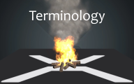

# Particle Terminology

 

- `Entity`
	[Entity](../../engine/entity-component-model/index.md) is the base class for objects that are managed by the high-level engine.
	
- `Particle System Component`
	[Component](../../engine/entity-component-model/index.md) is a modular element contained in the entity which provides functionality based on its type. The Particle System Component is a wrapper which provides a Particle System for the entity it is attached to.
	
- `Particle System`
	A Particle System is a low-level object and is the root for any particle effects. It acts as a container for all the different elements needed to simulate and draw a particle effect. A Particle System provides methods to draw, update, pause, stop and play a particle effect. From the game designer's point of view this is one logical unit, and what they use to create a particle effect. From the effects artist's point of view, this is the base on which the entire particle effect is built.
	
- `Particle Emitter`
	A [Particle Emitter](emitters.md) is another sub-container, which is responsible for one single visual aspect of the entire effect. For instance, a fire effect would have flames, embers and smoke, and each of them will be managed by a separate Particle Emitter, so we will have three emitters in total. The Particle Emitter manages how many particles there are, how they appear, move and disappear, and how they are drawn.
	
- `Particle`
	A particle is a single point in space, which can have several attributes associated with it. Usually position and remaining lifetime are mandatory fields. Other fields like velocity, size, color can be added, or you can customize them to add temperature, weight, or other attributes. To create a particle effect we need one or more particles flying around, driven by forces such as gravity, wind or magnetic fields.
	
- `Spawners`
	A [Spawner](spawners.md) is a simple module of the particle emitter which defines how many particles should be spawned and at what rate. To allow customization we have made it a separate element, rather than include it directly to the Particle Emitter. A single emitter can have one or more spawners, and the particles it emits every frame are combined from all of them.
		
- `Initializer`
	When a particle is first spawned, it doesn't have any attributes associated with it. The [Initializer](initializers.md) sets all particle attributes to their desired values, controlling its initial states for position, velocity, size, etc.
	
- `Updater`
	Once a particle is spawned it can change over time before it disappears. The [Updater](updaters.md) acts on all living particles over time, changing their attributes like position, velocity, color, etc. For example a gravity force is an updater which updates the particle's velocity with a constant value, making it accelerate faster towards the ground.
	
- `Shape Builder`
	Because a particle is just a point in space, it doesn't have a defined shape. The [Shape Builder](shape-builders.md) expands this point to a shape we can render. We can expand each particle as a camera-facing billboard, an oriented quad, or another shape. Alternatively, we might want to connect all the particles in a line, rendering them as a ribbon or a lightning. The Shape Builder manages all of this.
	
- `Material`
	Finally, the [Material](materials.md) defines how the expanded shape should be rendered, defining color, textures or other parameters to be used in the final composition.
	

