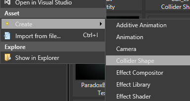
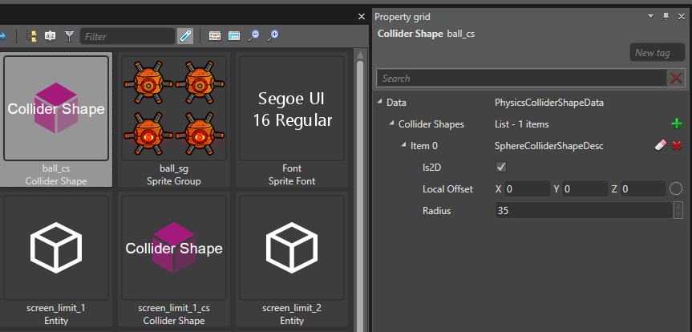
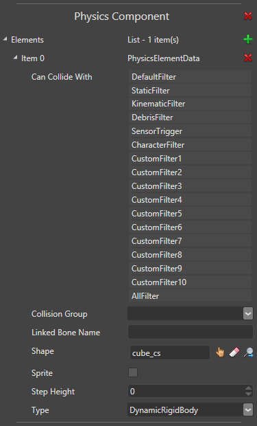

**This page is very outdated!! Please refer to the API documentation or samples.**

# Colliders Creation

First we create a Collider Shape Asset, this kind of asset can be compared to a model, where it actually describes a simplified shape describing what we are rendering to physics engine.

 

 

# Collider Shape Types

- **Box2DColliderShape: A simple 2D box shape, parameters are:** 
  - Local Offset (which is the offset with the real graphic mesh).
  - Half Extent size of the box.
- **BoxColliderShape: A simple 3D box shape, parameters are:** 
  - Local Offset (which is the offset with the real graphic mesh).
  - Half Extents size of the box in 3D Vector3.
- **CapsuleColliderShape: A capsule shape ideal for character controllers, parameters are:**
  - Local Offset (which is the offset with the real graphic mesh).
  - Radius of the capsule.
  - Height of the capsule.
  - Up Axis (this must be either (1,0,0),(0,1,0),(0,0,1)). 
- **ConvexHullColliderShape: Either a simple wrapping convex hull or a complex convex decomposition, parameters are:**
  - Model asset from where the engine will derive the convex hull.
  - Simple Wrap, if this is checked the following parameters are totally ignored, as only a simple convex hull of the whole model will be generated.
  - Depth will control how many sub convex hulls will be created, more depth will result in a more complex decomposition.
  - Position Sampling, how many position samples to internally compute clipping planes ( the higher the more complex ).
  - Angle Sampling, how many angle samples to internally compute clipping planes ( the higher the more complex ), nested with position samples, for each position sample it will compute the amount defined here.
  - Position Refine, if > 0 the computation will try to further improve the shape position sampling (this will slow down the process).
  - Angle Refine, if > 0 the computation will try to further improve the shape angle sampling (this will slow down the process).
  - Alpha applied to the concavity during crippling plane approximation.
  - Threshold of concavity, rising this will make the shape simpler.
- **CylinderColliderShape: A 3D Cylinder shape, similar to the cube the parameters are:** 
  - Local Offset (which is the offset with the real graphic mesh).
  - Half Extents size of the box in 3D Vector3.
  - Up Axis (this must be either (1,0,0),(0,1,0),(0,0,1)).
- **SphereColliderShape: A sphere when Is2D is off or a circle when Is2D is on, parameters are:** 
  - Is2D.
  - Local Offset (which is the offset with the real graphic mesh).
  - Radius.
- **StaticPlaneColliderShape: A static plane that is solid to infinity on one side. Several of these can be used to confine a convex space in a manner that completely prevents tunneling to the outside. The plane itself is specified with a normal and distance (Offset) as is standard in mathematics.**

Using multiple shapes within the same Collider Shape will automatically create a Compound shape internally. 

A complex convex hull will take time to be computed and currently there is no feedback in the GameStudio, the best way to figure this is to assign the collider to a PhysicsComponent in an entity and wait until the preview shows up.

Second we need to add the PhysicsComponent to the entity we want to have physics enabled.

 

 An entity's Physics Component can have multiple Elements, this is useful when the entity is actually representing a complex model like a character or a vehicle, where skinned meshes are used.

> **Error**
> 
> Currently skinned meshes and physics are not working properly, but this will be fixed very soon    

 

# Parameters description

- Can Collide WIth: 
  - Select which collider groups this element can collide with, when nothing is selected AllFilter is intended to be default.
- Collision Group: 
  - The collision group of this element, default is AllFilter.
- Linked Bone Name: 
  - In the case of skinned mesh this must be the bone node name linked with this element.
- Shape: 
  - the Collider Shape of this element.
- Sprite: 
  - If this element is associated with a Sprite Component's sprite. This is necessary because Sprites use an inverted Y axis and the physics engine must be aware of that.
- Step Height: 
  - Only valid for CharacterController type, describes the max slope height a character can climb.
- Type: 
  - The physics type of this element. Types are:
    - PhantomCollider: A phantom collider can be considered like a trigger that will produce collision events but won't affect dynamic forces.
    - StaticCollider: A static collider is a collider that is not supposed to move during simulations ( although can be moved programmatically ).
    - StaticRigidBody: A static rigidbody is a collider that is not supposed to move during simulations ( although can be moved programmatically ), being a rigidbody enables more features.
    - DynamicRigidBody: A dynamic rigidbody is a collider that will be fully simulated by the physics engine, and so the physics engine will be the authority for transformations.
    - KinematicRigidBody: A kinematic rigidbody is a collider that will affect the dynamic world like a dynamic rigidbody but instead the Game engine will be the authority for transformations. Ideal for elevators, platforms etc.
    - CharacterController: A character controller is a special collider that supports actions live movement and jump. Ideal for game characters.

 

 

