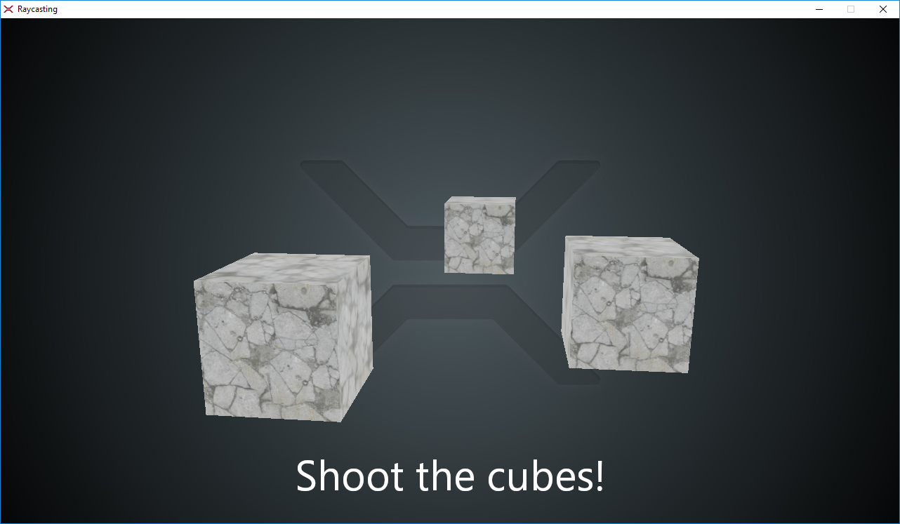

# How to find objects under the mouse cursor

<div class="doc-incomplete"/>

This page will show you how to find objects under the mouse cursor.

Start a new Game Project and select the **Raycasting Sample** project under Samples > Physics. and run the sample.



You'll notice that the cubes in this sample respond by clicking on them in the viewport. We'll explain how this is achieved by using raycasting.

1. Open the project in Visual Studio, by clicking  in Game Studio

2. Open the script called **RaycastingScript.cs** from the .Game project.

The part we're interested in, is the ```Raycast``` function:

```
    private void Raycast(Vector2 screenPos)
    {
        // screenPos is in normalized coordinates, multiply by render device's X and Y resolution to get pixel coordinates
        var backBuffer = GraphicsDevice.Presenter.BackBuffer;
        screenPos.X *= backBuffer.Width;
        screenPos.Y *= backBuffer.Height;

        var viewport = new Viewport(0, 0, backBuffer.Width, backBuffer.Height);
        
        // project screen coordinate for near plane back into world space
        var unprojectedNear =
            viewport.Unproject(
                new Vector3(screenPos, 0.0f),
                camera.ProjectionMatrix,
                camera.ViewMatrix,
                Matrix.Identity);

         // project screen coordinate for far plane back into world space
        var unprojectedFar =
            viewport.Unproject(
                new Vector3(screenPos, 1.0f),
                camera.ProjectionMatrix,
                camera.ViewMatrix,
                Matrix.Identity);

        // Now cast a ray to find the first collider that intersects
        var result = simulation.Raycast(unprojectedNear, unprojectedFar);
        if (!result.Succeeded || result.Collider == null) return;

        var rigidBody = result.Collider as RigidbodyComponent;
        if (rigidBody == null) return;

        rigidBody.Activate();
        rigidBody.ApplyImpulse(new Vector3(0, 5, 0));
    }
```

Let's first define what we are trying to do:

We want to find the collider objects in our scene that are displayed under the mouse cursor. The mouse cursor works in **Screen space**. We need to find 2 points in 3D, or **World space**, that define a ray, that map to this screen coordinate. To do this we take 2 points in screenspace, where the _X_ and _Y_ coordinates are the screen coordinates, and de _Z_ coordinates are 0 and 1 respectively. _Z_ 0 corresponds to the near plane of the view frustum and 1 to the far plane. When we project these points back into world space, we have a ray that corresponds to the screen coordinate extending through are complete visible range of the view frustum.