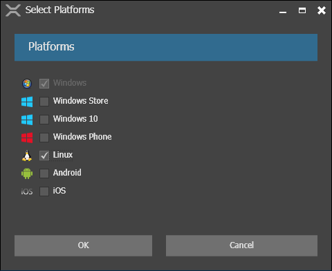
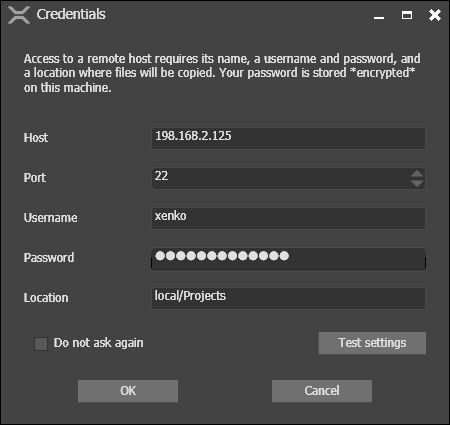
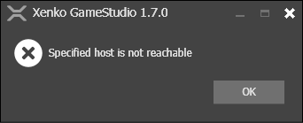
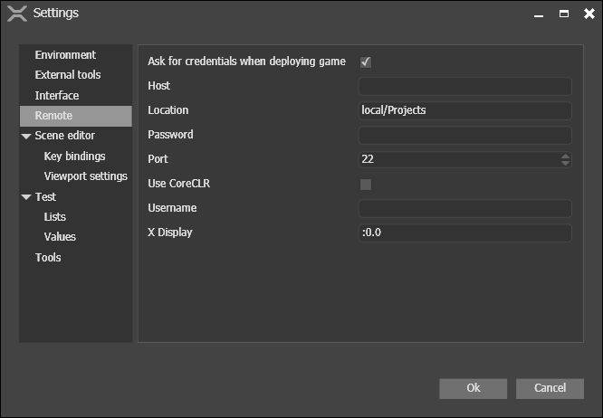
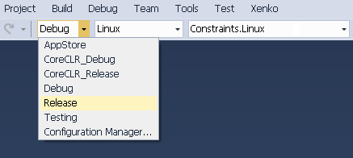

# Xenko On Linux

## Setup

Make sure to first follow the [requirements and setup instructions](setup.md)

##Creating a Linux Game

Create a new game in GameStudio and make sure to select Linux as one of the target platform.



Once you have done this, you just have to select Linux in the platform selector and press F5 to build and start the current project.


The first time you will need to enter information about your Linux host as shown below:


When your information is entered as below:



You should test your credentials by clicking the **Test settings** button. If you made an error, you will get



When there is no error you will get:


Once you are done, click the **OK** button to continue. At this point, it will copy all the files over your Linux host in a subdirectory of the location you will have provided. The name of that subdirectory is the name of your game.

In the event something goes wrong, check the **Output** pane to get more details.

## Settings

All the credentials you will have entered the first time is saved in the Settings dialog:



The password is saved encrypted using the Micrsoft *System.Security.Cryptograph.ProtectedData.Protect* method for the current user and saved in Base64 which is displayed in the Settings. For the time being, one cannot change the password from the Settings dialog.

In addition to the credentials information you will have 2 additional settings that control the execution of a game:
* Use CoreCLR: force execution using .NET Core.
* X Display: force execution on a specific X display of your Linux host.

## Compiling outside of GameStudio

Like any Xenko projects, you can also compile them directly from Visual Studio or from the command line. In both cases, you need to select a valid configuration:
* Debug
* Release
* CoreCLR_Debug
* CoreCLR_Release

The first two will target Mono, while the last two will target .NET Core.

### Visual Studio

Once your project is loaded in Visual Studio, select the Linux project. In the Solution Configurations drop down, you will have the choice among many choices and select one among the valid Linux configurations:




### MSBuild

From a command line, you can compile for Linux using the following command:

```
msbuild /p:Platform=Linux /p:Configuration=CONFIG YourGame.sln
```

Where you will replace **CONFIG** with one of the valid Linux configurations.

## Known Limitations

* No debugging facility yet
* Switching the rendering graphics platform might cause the game to hang on startup. As a workaround, delete on the Linux host the following directories *cache*/*local*/*roaming* in the directory where the game was deployed.


