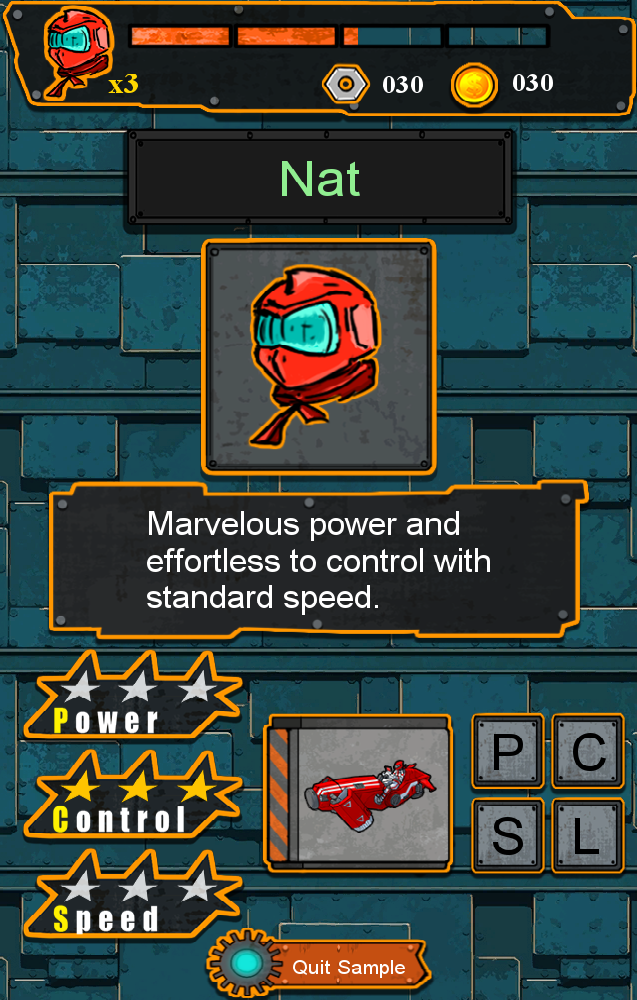
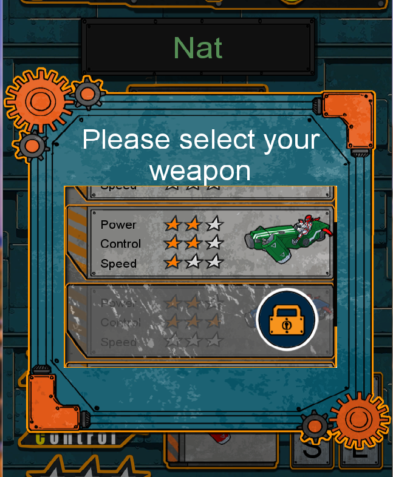

# UI

Xenko contains a complete UI system to build visually impressive in-game UI interfaces.

It is built upon a simplified design of [Windows Presentation Foundation (WPF)](http://msdn.microsoft.com/en-us/library/ms754130%28v=vs.110%29.aspx)  so that people can get quickly up to speed.

Many of the usual components and containers are all here, and on top of that it supports both 2D and 3D in a resolution-independent way.

> **Note**
> 
> It doesn't support editor yet, but please be assured that's in our roadmap.    

# Controls

Many components are available out of the box, including:

- @'SiliconStudio.Xenko.UI.Controls.ImageElement'
- @'SiliconStudio.Xenko.UI.Controls.ContentControl'
  - @'SiliconStudio.Xenko.UI.Controls.ScrollViewer'
  - @'SiliconStudio.Xenko.UI.Controls.Button'
    - @'SiliconStudio.Xenko.UI.Controls.ToggleButton'
  - @'SiliconStudio.Xenko.UI.Controls.ContentDecorator'
- @'SiliconStudio.Xenko.UI.Controls.TextBlock'
  - @'SiliconStudio.Xenko.UI.Controls.ScrollingText'
- @'SiliconStudio.Xenko.UI.Controls.EditText' (displays soft keyboard on mobile devices)
- @'SiliconStudio.Xenko.UI.Panels.Panel'
  - @'SiliconStudio.Xenko.UI.Panels.StackPanel' (supports virtualization)
  - @'SiliconStudio.Xenko.UI.Panels.Grid'
  - @'SiliconStudio.Xenko.UI.Panels.UniformGrid'
  - @'SiliconStudio.Xenko.UI.Panels.Canvas'
- @'SiliconStudio.Xenko.UI.Controls.ScrollBar'
- @'SiliconStudio.Xenko.UI.Controls.ModalElement'

And of course, you can create your own!

A class diagram is available [here](controls/uielement-class-diagram.md).

# Examples

You can find a complete example by creating a new project in [Xenko Studio](../xenko-studio/index.md) and selecting the **GameMenu** template.

 

 

# Performance

Drawing of multiple elements will be batched using a 3D Sprite batch renderer to reduce number of draw call. Objective is to keep CPU available for more important stuff.

