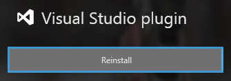

Beginner

# Xenko launcher

After you install Xenko, the first window that opens on your system is the [Xenko launcher](xref:xenko-launcher). The launcher lets you manage te different versions that have been installed on your system. The [Xenko launcher](xref:xenko-launcher) helps you manage and start the various versions of [Game Studio](xref:game-studio). Using the **Xenko launcher**, you can also:

 * (Re)install the Xenko Visual Studio plugin
 * Open your recent Xenko projects
 * Access the Xenko documentation and news streams
 * Interact with the Xenko communities

This page will show you the details of what you can do with the launcher.

_Xenko launcher_

## Installing Xenko and starting the Game Studio

The launcher prompts you initially to the install latest version of Xenko as well as the Visual Studio plugin. Using this plugin, you can edit your [shaders](xref:shaders) directly from Visual Studio. This plugin provides the features of syntax highlighting, live-code-analysis with validation, error-checking, and navigation. It is not mandatory to install this plugin, however we recommend to install it.

You can start the active version of Game Studio by clicking the Start button. To change the active version, click a version in the **Switch/update** version section to make the selected version, your active version.

_Start button of Xenko launcher_

## Version management

With Xenko launcher, you can manage the various versions of Xenko.

You can switch to another version of Xenko or update your current version of Xenko from the **Switch/update version** section. The launcher also allows you to choose which Xenko version(s) you want to have installed on your machine. Versions might not be compatible with each other, and therefore the version of Xenko for which a project was developed, should be installed. This allows for projects that have been developed with different versions to keep working, without the need to upgrade them to a newer version.

The version number consists of 3 parts: Major.Minor.Build

 * **Major**: This update to the software adds significant changes to the program. In a Major version, the first digit of the version is changed; for example, 1.x.x is changed to 2.x.x.
 * **Minor**: This update to the software adds minor changes to the program. In a Minor version, the second digit of the version is changed; for example, 1.1.x is changed to 1.2.x.
 * **Build**: This is a change made to the software to fix bugs or problems found in the software. In a Bug fix version, the third digit of the version is changed; for example, 1.1.1 is changed to 1.1.2.

Xenko launcher allows you to choose the Xenko version because breaking changes may occur between versions and you may not necessarily want to update your application. However a release with just bugfixes, and therefore only a changed Build number, will never contain breaking changes, and is highly recommended to install. Bug fix versions cannot be reverted.

>**Note:** It is possible to upgrade projects that have been developed for older versions of Xenko, however manual changes might be needed to get the project working for a newer version. **Be sure to make a backup of your project and all related files before upgrading.**

After the Xenko installation has finished for the selected versions, click the required version. You can see the selected version on the Start button. Click the Start button. The selected version of Game Studio is launched.

In the **Switch/update version** section, you can:

 * Click the Release Notes button to view the release notes of a Xenko version.
 * Click the Download and Install button to install a Xenko version
 * Click the Uninstall button to uninstall a Xenko version.
 

_Various versions of Xenko_

## Visual Studio plugin

After you install Xenko, Xenko launcher opens automatically. Upon starting for the first time, it prompts you to install the Xenko Visual Studio plugin. Installation of this plugin is not mandatory. However, we recommend you to install it. Using this plugin, you can edit your @shaders directly from Visual Studio.

This plugin provides the following:

 * Syntax highlighting
 * Live-code-analysis with validation
 * Error-checking
 * Navigation (jump to definition)

 If you manually remove the Visual Studio plugin, you can install it again by clicking the Reinstall button.

_Visual Studio plugin_

## Recent projects

You can open your recent Xenko projects from this section just by clicking the name of a project. This section also allows you to convert a project to a newer version of Xenko, as displayed in the screenshot below.

>**Note:** When converting projects to a newer version of Xenko, the project might stop working after conversion. Manual changes might be needed to get the project working for a newer version. **Be sure to make a backup of your project and all related files before upgrading.**

_Projects section_
